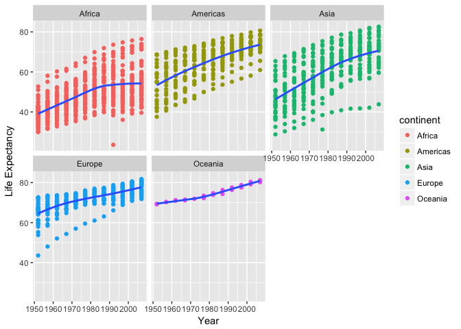
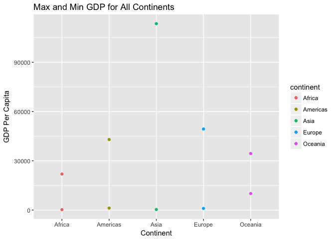
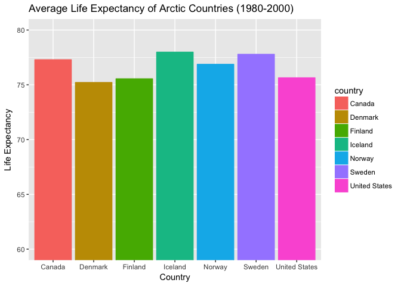
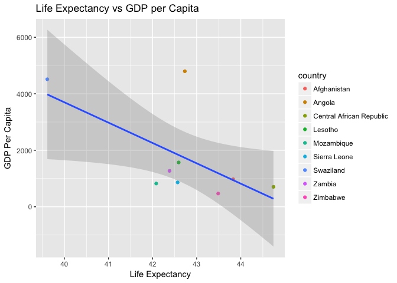

# HW03
Nathan Bendriem  
September 27, 2017  

Library(gapminder)

```r
library(gapminder)
library(tidyverse)
```

```
## Loading tidyverse: ggplot2
## Loading tidyverse: tibble
## Loading tidyverse: tidyr
## Loading tidyverse: readr
## Loading tidyverse: purrr
## Loading tidyverse: dplyr
```

```
## Conflicts with tidy packages ----------------------------------------------
```

```
## filter(): dplyr, stats
## lag():    dplyr, stats
```

# Homework 3

For this homework, we will still be using the gapminder dataset, as well as dplyr and ggplot for graphs and tables


## We are given a list of tasks, and are asked to pick at least three

- Get the maximum and minimum GDP per capita within the continents
- look at the spread of GDP per capita within the conitnents
- Compute a trimmed mean of life expectancy for different years
- How is life expectancy changing over time on different continents
- Report the absolute and/or relative abundance of countries with low life expectancy
- Or make up your own!

## Task 1

I will start by answering the task "how is life expectancy changing over time on different continents"

To set up the dplyr table, we will be using the select function and the gapminder dataset.  I will only be focusing on the years 1957 and 2007, the first and last years available from the dataset, to illustrate the change in life expectancy


```r
A <- gapminder %>% group_by(country) %>% mutate(deltaLifeExp=lifeExp[year==2007]-lifeExp[year==1957]) %>% select(continent, country, deltaLifeExp)


knitr::kable(A)
```


continent   country                     deltaLifeExp
----------  -------------------------  -------------
Asia        Afghanistan                     13.49600
Asia        Afghanistan                     13.49600
Asia        Afghanistan                     13.49600
Asia        Afghanistan                     13.49600
Asia        Afghanistan                     13.49600
Asia        Afghanistan                     13.49600
Asia        Afghanistan                     13.49600
Asia        Afghanistan                     13.49600
Asia        Afghanistan                     13.49600
Asia        Afghanistan                     13.49600
Asia        Afghanistan                     13.49600
Asia        Afghanistan                     13.49600
Europe      Albania                         17.14300
Europe      Albania                         17.14300
Europe      Albania                         17.14300
Europe      Albania                         17.14300
Europe      Albania                         17.14300
Europe      Albania                         17.14300
Europe      Albania                         17.14300
Europe      Albania                         17.14300
Europe      Albania                         17.14300
Europe      Albania                         17.14300
Europe      Albania                         17.14300
Europe      Albania                         17.14300
Africa      Algeria                         26.61600
Africa      Algeria                         26.61600
Africa      Algeria                         26.61600
Africa      Algeria                         26.61600
Africa      Algeria                         26.61600
Africa      Algeria                         26.61600
Africa      Algeria                         26.61600
Africa      Algeria                         26.61600
Africa      Algeria                         26.61600
Africa      Algeria                         26.61600
Africa      Algeria                         26.61600
Africa      Algeria                         26.61600
Africa      Angola                          10.73200
Africa      Angola                          10.73200
Africa      Angola                          10.73200
Africa      Angola                          10.73200
Africa      Angola                          10.73200
Africa      Angola                          10.73200
Africa      Angola                          10.73200
Africa      Angola                          10.73200
Africa      Angola                          10.73200
Africa      Angola                          10.73200
Africa      Angola                          10.73200
Africa      Angola                          10.73200
Americas    Argentina                       10.92100
Americas    Argentina                       10.92100
Americas    Argentina                       10.92100
Americas    Argentina                       10.92100
Americas    Argentina                       10.92100
Americas    Argentina                       10.92100
Americas    Argentina                       10.92100
Americas    Argentina                       10.92100
Americas    Argentina                       10.92100
Americas    Argentina                       10.92100
Americas    Argentina                       10.92100
Americas    Argentina                       10.92100
Oceania     Australia                       10.90500
Oceania     Australia                       10.90500
Oceania     Australia                       10.90500
Oceania     Australia                       10.90500
Oceania     Australia                       10.90500
Oceania     Australia                       10.90500
Oceania     Australia                       10.90500
Oceania     Australia                       10.90500
Oceania     Australia                       10.90500
Oceania     Australia                       10.90500
Oceania     Australia                       10.90500
Oceania     Australia                       10.90500
Europe      Austria                         12.34900
Europe      Austria                         12.34900
Europe      Austria                         12.34900
Europe      Austria                         12.34900
Europe      Austria                         12.34900
Europe      Austria                         12.34900
Europe      Austria                         12.34900
Europe      Austria                         12.34900
Europe      Austria                         12.34900
Europe      Austria                         12.34900
Europe      Austria                         12.34900
Europe      Austria                         12.34900
Asia        Bahrain                         21.80300
Asia        Bahrain                         21.80300
Asia        Bahrain                         21.80300
Asia        Bahrain                         21.80300
Asia        Bahrain                         21.80300
Asia        Bahrain                         21.80300
Asia        Bahrain                         21.80300
Asia        Bahrain                         21.80300
Asia        Bahrain                         21.80300
Asia        Bahrain                         21.80300
Asia        Bahrain                         21.80300
Asia        Bahrain                         21.80300
Asia        Bangladesh                      24.71400
Asia        Bangladesh                      24.71400
Asia        Bangladesh                      24.71400
Asia        Bangladesh                      24.71400
Asia        Bangladesh                      24.71400
Asia        Bangladesh                      24.71400
Asia        Bangladesh                      24.71400
Asia        Bangladesh                      24.71400
Asia        Bangladesh                      24.71400
Asia        Bangladesh                      24.71400
Asia        Bangladesh                      24.71400
Asia        Bangladesh                      24.71400
Europe      Belgium                         10.20100
Europe      Belgium                         10.20100
Europe      Belgium                         10.20100
Europe      Belgium                         10.20100
Europe      Belgium                         10.20100
Europe      Belgium                         10.20100
Europe      Belgium                         10.20100
Europe      Belgium                         10.20100
Europe      Belgium                         10.20100
Europe      Belgium                         10.20100
Europe      Belgium                         10.20100
Europe      Belgium                         10.20100
Africa      Benin                           16.37000
Africa      Benin                           16.37000
Africa      Benin                           16.37000
Africa      Benin                           16.37000
Africa      Benin                           16.37000
Africa      Benin                           16.37000
Africa      Benin                           16.37000
Africa      Benin                           16.37000
Africa      Benin                           16.37000
Africa      Benin                           16.37000
Africa      Benin                           16.37000
Africa      Benin                           16.37000
Americas    Bolivia                         23.66400
Americas    Bolivia                         23.66400
Americas    Bolivia                         23.66400
Americas    Bolivia                         23.66400
Americas    Bolivia                         23.66400
Americas    Bolivia                         23.66400
Americas    Bolivia                         23.66400
Americas    Bolivia                         23.66400
Americas    Bolivia                         23.66400
Americas    Bolivia                         23.66400
Americas    Bolivia                         23.66400
Americas    Bolivia                         23.66400
Europe      Bosnia and Herzegovina          16.40200
Europe      Bosnia and Herzegovina          16.40200
Europe      Bosnia and Herzegovina          16.40200
Europe      Bosnia and Herzegovina          16.40200
Europe      Bosnia and Herzegovina          16.40200
Europe      Bosnia and Herzegovina          16.40200
Europe      Bosnia and Herzegovina          16.40200
Europe      Bosnia and Herzegovina          16.40200
Europe      Bosnia and Herzegovina          16.40200
Europe      Bosnia and Herzegovina          16.40200
Europe      Bosnia and Herzegovina          16.40200
Europe      Bosnia and Herzegovina          16.40200
Africa      Botswana                         1.11000
Africa      Botswana                         1.11000
Africa      Botswana                         1.11000
Africa      Botswana                         1.11000
Africa      Botswana                         1.11000
Africa      Botswana                         1.11000
Africa      Botswana                         1.11000
Africa      Botswana                         1.11000
Africa      Botswana                         1.11000
Africa      Botswana                         1.11000
Africa      Botswana                         1.11000
Africa      Botswana                         1.11000
Americas    Brazil                          19.10500
Americas    Brazil                          19.10500
Americas    Brazil                          19.10500
Americas    Brazil                          19.10500
Americas    Brazil                          19.10500
Americas    Brazil                          19.10500
Americas    Brazil                          19.10500
Americas    Brazil                          19.10500
Americas    Brazil                          19.10500
Americas    Brazil                          19.10500
Americas    Brazil                          19.10500
Americas    Brazil                          19.10500
Europe      Bulgaria                         6.39500
Europe      Bulgaria                         6.39500
Europe      Bulgaria                         6.39500
Europe      Bulgaria                         6.39500
Europe      Bulgaria                         6.39500
Europe      Bulgaria                         6.39500
Europe      Bulgaria                         6.39500
Europe      Bulgaria                         6.39500
Europe      Bulgaria                         6.39500
Europe      Bulgaria                         6.39500
Europe      Bulgaria                         6.39500
Europe      Bulgaria                         6.39500
Africa      Burkina Faso                    17.38900
Africa      Burkina Faso                    17.38900
Africa      Burkina Faso                    17.38900
Africa      Burkina Faso                    17.38900
Africa      Burkina Faso                    17.38900
Africa      Burkina Faso                    17.38900
Africa      Burkina Faso                    17.38900
Africa      Burkina Faso                    17.38900
Africa      Burkina Faso                    17.38900
Africa      Burkina Faso                    17.38900
Africa      Burkina Faso                    17.38900
Africa      Burkina Faso                    17.38900
Africa      Burundi                          9.04700
Africa      Burundi                          9.04700
Africa      Burundi                          9.04700
Africa      Burundi                          9.04700
Africa      Burundi                          9.04700
Africa      Burundi                          9.04700
Africa      Burundi                          9.04700
Africa      Burundi                          9.04700
Africa      Burundi                          9.04700
Africa      Burundi                          9.04700
Africa      Burundi                          9.04700
Africa      Burundi                          9.04700
Asia        Cambodia                        18.35700
Asia        Cambodia                        18.35700
Asia        Cambodia                        18.35700
Asia        Cambodia                        18.35700
Asia        Cambodia                        18.35700
Asia        Cambodia                        18.35700
Asia        Cambodia                        18.35700
Asia        Cambodia                        18.35700
Asia        Cambodia                        18.35700
Asia        Cambodia                        18.35700
Asia        Cambodia                        18.35700
Asia        Cambodia                        18.35700
Africa      Cameroon                        10.00200
Africa      Cameroon                        10.00200
Africa      Cameroon                        10.00200
Africa      Cameroon                        10.00200
Africa      Cameroon                        10.00200
Africa      Cameroon                        10.00200
Africa      Cameroon                        10.00200
Africa      Cameroon                        10.00200
Africa      Cameroon                        10.00200
Africa      Cameroon                        10.00200
Africa      Cameroon                        10.00200
Africa      Cameroon                        10.00200
Americas    Canada                          10.69300
Americas    Canada                          10.69300
Americas    Canada                          10.69300
Americas    Canada                          10.69300
Americas    Canada                          10.69300
Americas    Canada                          10.69300
Americas    Canada                          10.69300
Americas    Canada                          10.69300
Americas    Canada                          10.69300
Americas    Canada                          10.69300
Americas    Canada                          10.69300
Americas    Canada                          10.69300
Africa      Central African Republic         7.27700
Africa      Central African Republic         7.27700
Africa      Central African Republic         7.27700
Africa      Central African Republic         7.27700
Africa      Central African Republic         7.27700
Africa      Central African Republic         7.27700
Africa      Central African Republic         7.27700
Africa      Central African Republic         7.27700
Africa      Central African Republic         7.27700
Africa      Central African Republic         7.27700
Africa      Central African Republic         7.27700
Africa      Central African Republic         7.27700
Africa      Chad                            10.77000
Africa      Chad                            10.77000
Africa      Chad                            10.77000
Africa      Chad                            10.77000
Africa      Chad                            10.77000
Africa      Chad                            10.77000
Africa      Chad                            10.77000
Africa      Chad                            10.77000
Africa      Chad                            10.77000
Africa      Chad                            10.77000
Africa      Chad                            10.77000
Africa      Chad                            10.77000
Americas    Chile                           22.47900
Americas    Chile                           22.47900
Americas    Chile                           22.47900
Americas    Chile                           22.47900
Americas    Chile                           22.47900
Americas    Chile                           22.47900
Americas    Chile                           22.47900
Americas    Chile                           22.47900
Americas    Chile                           22.47900
Americas    Chile                           22.47900
Americas    Chile                           22.47900
Americas    Chile                           22.47900
Asia        China                           22.41204
Asia        China                           22.41204
Asia        China                           22.41204
Asia        China                           22.41204
Asia        China                           22.41204
Asia        China                           22.41204
Asia        China                           22.41204
Asia        China                           22.41204
Asia        China                           22.41204
Asia        China                           22.41204
Asia        China                           22.41204
Asia        China                           22.41204
Americas    Colombia                        17.77100
Americas    Colombia                        17.77100
Americas    Colombia                        17.77100
Americas    Colombia                        17.77100
Americas    Colombia                        17.77100
Americas    Colombia                        17.77100
Americas    Colombia                        17.77100
Americas    Colombia                        17.77100
Americas    Colombia                        17.77100
Americas    Colombia                        17.77100
Americas    Colombia                        17.77100
Americas    Colombia                        17.77100
Africa      Comoros                         22.69200
Africa      Comoros                         22.69200
Africa      Comoros                         22.69200
Africa      Comoros                         22.69200
Africa      Comoros                         22.69200
Africa      Comoros                         22.69200
Africa      Comoros                         22.69200
Africa      Comoros                         22.69200
Africa      Comoros                         22.69200
Africa      Comoros                         22.69200
Africa      Comoros                         22.69200
Africa      Comoros                         22.69200
Africa      Congo, Dem. Rep.                 5.81000
Africa      Congo, Dem. Rep.                 5.81000
Africa      Congo, Dem. Rep.                 5.81000
Africa      Congo, Dem. Rep.                 5.81000
Africa      Congo, Dem. Rep.                 5.81000
Africa      Congo, Dem. Rep.                 5.81000
Africa      Congo, Dem. Rep.                 5.81000
Africa      Congo, Dem. Rep.                 5.81000
Africa      Congo, Dem. Rep.                 5.81000
Africa      Congo, Dem. Rep.                 5.81000
Africa      Congo, Dem. Rep.                 5.81000
Africa      Congo, Dem. Rep.                 5.81000
Africa      Congo, Rep.                     10.26900
Africa      Congo, Rep.                     10.26900
Africa      Congo, Rep.                     10.26900
Africa      Congo, Rep.                     10.26900
Africa      Congo, Rep.                     10.26900
Africa      Congo, Rep.                     10.26900
Africa      Congo, Rep.                     10.26900
Africa      Congo, Rep.                     10.26900
Africa      Congo, Rep.                     10.26900
Africa      Congo, Rep.                     10.26900
Africa      Congo, Rep.                     10.26900
Africa      Congo, Rep.                     10.26900
Americas    Costa Rica                      18.75600
Americas    Costa Rica                      18.75600
Americas    Costa Rica                      18.75600
Americas    Costa Rica                      18.75600
Americas    Costa Rica                      18.75600
Americas    Costa Rica                      18.75600
Americas    Costa Rica                      18.75600
Americas    Costa Rica                      18.75600
Americas    Costa Rica                      18.75600
Americas    Costa Rica                      18.75600
Americas    Costa Rica                      18.75600
Americas    Costa Rica                      18.75600
Africa      Cote d'Ivoire                    5.85900
Africa      Cote d'Ivoire                    5.85900
Africa      Cote d'Ivoire                    5.85900
Africa      Cote d'Ivoire                    5.85900
Africa      Cote d'Ivoire                    5.85900
Africa      Cote d'Ivoire                    5.85900
Africa      Cote d'Ivoire                    5.85900
Africa      Cote d'Ivoire                    5.85900
Africa      Cote d'Ivoire                    5.85900
Africa      Cote d'Ivoire                    5.85900
Africa      Cote d'Ivoire                    5.85900
Africa      Cote d'Ivoire                    5.85900
Europe      Croatia                         10.97800
Europe      Croatia                         10.97800
Europe      Croatia                         10.97800
Europe      Croatia                         10.97800
Europe      Croatia                         10.97800
Europe      Croatia                         10.97800
Europe      Croatia                         10.97800
Europe      Croatia                         10.97800
Europe      Croatia                         10.97800
Europe      Croatia                         10.97800
Europe      Croatia                         10.97800
Europe      Croatia                         10.97800
Americas    Cuba                            15.94800
Americas    Cuba                            15.94800
Americas    Cuba                            15.94800
Americas    Cuba                            15.94800
Americas    Cuba                            15.94800
Americas    Cuba                            15.94800
Americas    Cuba                            15.94800
Americas    Cuba                            15.94800
Americas    Cuba                            15.94800
Americas    Cuba                            15.94800
Americas    Cuba                            15.94800
Americas    Cuba                            15.94800
Europe      Czech Republic                   7.45600
Europe      Czech Republic                   7.45600
Europe      Czech Republic                   7.45600
Europe      Czech Republic                   7.45600
Europe      Czech Republic                   7.45600
Europe      Czech Republic                   7.45600
Europe      Czech Republic                   7.45600
Europe      Czech Republic                   7.45600
Europe      Czech Republic                   7.45600
Europe      Czech Republic                   7.45600
Europe      Czech Republic                   7.45600
Europe      Czech Republic                   7.45600
Europe      Denmark                          6.52200
Europe      Denmark                          6.52200
Europe      Denmark                          6.52200
Europe      Denmark                          6.52200
Europe      Denmark                          6.52200
Europe      Denmark                          6.52200
Europe      Denmark                          6.52200
Europe      Denmark                          6.52200
Europe      Denmark                          6.52200
Europe      Denmark                          6.52200
Europe      Denmark                          6.52200
Europe      Denmark                          6.52200
Africa      Djibouti                        17.46300
Africa      Djibouti                        17.46300
Africa      Djibouti                        17.46300
Africa      Djibouti                        17.46300
Africa      Djibouti                        17.46300
Africa      Djibouti                        17.46300
Africa      Djibouti                        17.46300
Africa      Djibouti                        17.46300
Africa      Djibouti                        17.46300
Africa      Djibouti                        17.46300
Africa      Djibouti                        17.46300
Africa      Djibouti                        17.46300
Americas    Dominican Republic              22.40700
Americas    Dominican Republic              22.40700
Americas    Dominican Republic              22.40700
Americas    Dominican Republic              22.40700
Americas    Dominican Republic              22.40700
Americas    Dominican Republic              22.40700
Americas    Dominican Republic              22.40700
Americas    Dominican Republic              22.40700
Americas    Dominican Republic              22.40700
Americas    Dominican Republic              22.40700
Americas    Dominican Republic              22.40700
Americas    Dominican Republic              22.40700
Americas    Ecuador                         23.63800
Americas    Ecuador                         23.63800
Americas    Ecuador                         23.63800
Americas    Ecuador                         23.63800
Americas    Ecuador                         23.63800
Americas    Ecuador                         23.63800
Americas    Ecuador                         23.63800
Americas    Ecuador                         23.63800
Americas    Ecuador                         23.63800
Americas    Ecuador                         23.63800
Americas    Ecuador                         23.63800
Americas    Ecuador                         23.63800
Africa      Egypt                           26.89400
Africa      Egypt                           26.89400
Africa      Egypt                           26.89400
Africa      Egypt                           26.89400
Africa      Egypt                           26.89400
Africa      Egypt                           26.89400
Africa      Egypt                           26.89400
Africa      Egypt                           26.89400
Africa      Egypt                           26.89400
Africa      Egypt                           26.89400
Africa      Egypt                           26.89400
Africa      Egypt                           26.89400
Americas    El Salvador                     23.30800
Americas    El Salvador                     23.30800
Americas    El Salvador                     23.30800
Americas    El Salvador                     23.30800
Americas    El Salvador                     23.30800
Americas    El Salvador                     23.30800
Americas    El Salvador                     23.30800
Americas    El Salvador                     23.30800
Americas    El Salvador                     23.30800
Americas    El Salvador                     23.30800
Americas    El Salvador                     23.30800
Americas    El Salvador                     23.30800
Africa      Equatorial Guinea               15.59600
Africa      Equatorial Guinea               15.59600
Africa      Equatorial Guinea               15.59600
Africa      Equatorial Guinea               15.59600
Africa      Equatorial Guinea               15.59600
Africa      Equatorial Guinea               15.59600
Africa      Equatorial Guinea               15.59600
Africa      Equatorial Guinea               15.59600
Africa      Equatorial Guinea               15.59600
Africa      Equatorial Guinea               15.59600
Africa      Equatorial Guinea               15.59600
Africa      Equatorial Guinea               15.59600
Africa      Eritrea                         19.99300
Africa      Eritrea                         19.99300
Africa      Eritrea                         19.99300
Africa      Eritrea                         19.99300
Africa      Eritrea                         19.99300
Africa      Eritrea                         19.99300
Africa      Eritrea                         19.99300
Africa      Eritrea                         19.99300
Africa      Eritrea                         19.99300
Africa      Eritrea                         19.99300
Africa      Eritrea                         19.99300
Africa      Eritrea                         19.99300
Africa      Ethiopia                        16.28000
Africa      Ethiopia                        16.28000
Africa      Ethiopia                        16.28000
Africa      Ethiopia                        16.28000
Africa      Ethiopia                        16.28000
Africa      Ethiopia                        16.28000
Africa      Ethiopia                        16.28000
Africa      Ethiopia                        16.28000
Africa      Ethiopia                        16.28000
Africa      Ethiopia                        16.28000
Africa      Ethiopia                        16.28000
Africa      Ethiopia                        16.28000
Europe      Finland                         11.82300
Europe      Finland                         11.82300
Europe      Finland                         11.82300
Europe      Finland                         11.82300
Europe      Finland                         11.82300
Europe      Finland                         11.82300
Europe      Finland                         11.82300
Europe      Finland                         11.82300
Europe      Finland                         11.82300
Europe      Finland                         11.82300
Europe      Finland                         11.82300
Europe      Finland                         11.82300
Europe      France                          11.72700
Europe      France                          11.72700
Europe      France                          11.72700
Europe      France                          11.72700
Europe      France                          11.72700
Europe      France                          11.72700
Europe      France                          11.72700
Europe      France                          11.72700
Europe      France                          11.72700
Europe      France                          11.72700
Europe      France                          11.72700
Europe      France                          11.72700
Africa      Gabon                           17.73600
Africa      Gabon                           17.73600
Africa      Gabon                           17.73600
Africa      Gabon                           17.73600
Africa      Gabon                           17.73600
Africa      Gabon                           17.73600
Africa      Gabon                           17.73600
Africa      Gabon                           17.73600
Africa      Gabon                           17.73600
Africa      Gabon                           17.73600
Africa      Gabon                           17.73600
Africa      Gabon                           17.73600
Africa      Gambia                          27.38300
Africa      Gambia                          27.38300
Africa      Gambia                          27.38300
Africa      Gambia                          27.38300
Africa      Gambia                          27.38300
Africa      Gambia                          27.38300
Africa      Gambia                          27.38300
Africa      Gambia                          27.38300
Africa      Gambia                          27.38300
Africa      Gambia                          27.38300
Africa      Gambia                          27.38300
Africa      Gambia                          27.38300
Europe      Germany                         10.30600
Europe      Germany                         10.30600
Europe      Germany                         10.30600
Europe      Germany                         10.30600
Europe      Germany                         10.30600
Europe      Germany                         10.30600
Europe      Germany                         10.30600
Europe      Germany                         10.30600
Europe      Germany                         10.30600
Europe      Germany                         10.30600
Europe      Germany                         10.30600
Europe      Germany                         10.30600
Africa      Ghana                           15.24300
Africa      Ghana                           15.24300
Africa      Ghana                           15.24300
Africa      Ghana                           15.24300
Africa      Ghana                           15.24300
Africa      Ghana                           15.24300
Africa      Ghana                           15.24300
Africa      Ghana                           15.24300
Africa      Ghana                           15.24300
Africa      Ghana                           15.24300
Africa      Ghana                           15.24300
Africa      Ghana                           15.24300
Europe      Greece                          11.62300
Europe      Greece                          11.62300
Europe      Greece                          11.62300
Europe      Greece                          11.62300
Europe      Greece                          11.62300
Europe      Greece                          11.62300
Europe      Greece                          11.62300
Europe      Greece                          11.62300
Europe      Greece                          11.62300
Europe      Greece                          11.62300
Europe      Greece                          11.62300
Europe      Greece                          11.62300
Americas    Guatemala                       26.11700
Americas    Guatemala                       26.11700
Americas    Guatemala                       26.11700
Americas    Guatemala                       26.11700
Americas    Guatemala                       26.11700
Americas    Guatemala                       26.11700
Americas    Guatemala                       26.11700
Americas    Guatemala                       26.11700
Americas    Guatemala                       26.11700
Americas    Guatemala                       26.11700
Americas    Guatemala                       26.11700
Americas    Guatemala                       26.11700
Africa      Guinea                          21.44900
Africa      Guinea                          21.44900
Africa      Guinea                          21.44900
Africa      Guinea                          21.44900
Africa      Guinea                          21.44900
Africa      Guinea                          21.44900
Africa      Guinea                          21.44900
Africa      Guinea                          21.44900
Africa      Guinea                          21.44900
Africa      Guinea                          21.44900
Africa      Guinea                          21.44900
Africa      Guinea                          21.44900
Africa      Guinea-Bissau                   12.89900
Africa      Guinea-Bissau                   12.89900
Africa      Guinea-Bissau                   12.89900
Africa      Guinea-Bissau                   12.89900
Africa      Guinea-Bissau                   12.89900
Africa      Guinea-Bissau                   12.89900
Africa      Guinea-Bissau                   12.89900
Africa      Guinea-Bissau                   12.89900
Africa      Guinea-Bissau                   12.89900
Africa      Guinea-Bissau                   12.89900
Africa      Guinea-Bissau                   12.89900
Africa      Guinea-Bissau                   12.89900
Americas    Haiti                           20.22000
Americas    Haiti                           20.22000
Americas    Haiti                           20.22000
Americas    Haiti                           20.22000
Americas    Haiti                           20.22000
Americas    Haiti                           20.22000
Americas    Haiti                           20.22000
Americas    Haiti                           20.22000
Americas    Haiti                           20.22000
Americas    Haiti                           20.22000
Americas    Haiti                           20.22000
Americas    Haiti                           20.22000
Americas    Honduras                        25.53300
Americas    Honduras                        25.53300
Americas    Honduras                        25.53300
Americas    Honduras                        25.53300
Americas    Honduras                        25.53300
Americas    Honduras                        25.53300
Americas    Honduras                        25.53300
Americas    Honduras                        25.53300
Americas    Honduras                        25.53300
Americas    Honduras                        25.53300
Americas    Honduras                        25.53300
Americas    Honduras                        25.53300
Asia        Hong Kong, China                17.45800
Asia        Hong Kong, China                17.45800
Asia        Hong Kong, China                17.45800
Asia        Hong Kong, China                17.45800
Asia        Hong Kong, China                17.45800
Asia        Hong Kong, China                17.45800
Asia        Hong Kong, China                17.45800
Asia        Hong Kong, China                17.45800
Asia        Hong Kong, China                17.45800
Asia        Hong Kong, China                17.45800
Asia        Hong Kong, China                17.45800
Asia        Hong Kong, China                17.45800
Europe      Hungary                          6.92800
Europe      Hungary                          6.92800
Europe      Hungary                          6.92800
Europe      Hungary                          6.92800
Europe      Hungary                          6.92800
Europe      Hungary                          6.92800
Europe      Hungary                          6.92800
Europe      Hungary                          6.92800
Europe      Hungary                          6.92800
Europe      Hungary                          6.92800
Europe      Hungary                          6.92800
Europe      Hungary                          6.92800
Europe      Iceland                          8.28700
Europe      Iceland                          8.28700
Europe      Iceland                          8.28700
Europe      Iceland                          8.28700
Europe      Iceland                          8.28700
Europe      Iceland                          8.28700
Europe      Iceland                          8.28700
Europe      Iceland                          8.28700
Europe      Iceland                          8.28700
Europe      Iceland                          8.28700
Europe      Iceland                          8.28700
Europe      Iceland                          8.28700
Asia        India                           24.44900
Asia        India                           24.44900
Asia        India                           24.44900
Asia        India                           24.44900
Asia        India                           24.44900
Asia        India                           24.44900
Asia        India                           24.44900
Asia        India                           24.44900
Asia        India                           24.44900
Asia        India                           24.44900
Asia        India                           24.44900
Asia        India                           24.44900
Asia        Indonesia                       30.73200
Asia        Indonesia                       30.73200
Asia        Indonesia                       30.73200
Asia        Indonesia                       30.73200
Asia        Indonesia                       30.73200
Asia        Indonesia                       30.73200
Asia        Indonesia                       30.73200
Asia        Indonesia                       30.73200
Asia        Indonesia                       30.73200
Asia        Indonesia                       30.73200
Asia        Indonesia                       30.73200
Asia        Indonesia                       30.73200
Asia        Iran                            23.78300
Asia        Iran                            23.78300
Asia        Iran                            23.78300
Asia        Iran                            23.78300
Asia        Iran                            23.78300
Asia        Iran                            23.78300
Asia        Iran                            23.78300
Asia        Iran                            23.78300
Asia        Iran                            23.78300
Asia        Iran                            23.78300
Asia        Iran                            23.78300
Asia        Iran                            23.78300
Asia        Iraq                            11.10800
Asia        Iraq                            11.10800
Asia        Iraq                            11.10800
Asia        Iraq                            11.10800
Asia        Iraq                            11.10800
Asia        Iraq                            11.10800
Asia        Iraq                            11.10800
Asia        Iraq                            11.10800
Asia        Iraq                            11.10800
Asia        Iraq                            11.10800
Asia        Iraq                            11.10800
Asia        Iraq                            11.10800
Europe      Ireland                          9.98500
Europe      Ireland                          9.98500
Europe      Ireland                          9.98500
Europe      Ireland                          9.98500
Europe      Ireland                          9.98500
Europe      Ireland                          9.98500
Europe      Ireland                          9.98500
Europe      Ireland                          9.98500
Europe      Ireland                          9.98500
Europe      Ireland                          9.98500
Europe      Ireland                          9.98500
Europe      Ireland                          9.98500
Asia        Israel                          12.90500
Asia        Israel                          12.90500
Asia        Israel                          12.90500
Asia        Israel                          12.90500
Asia        Israel                          12.90500
Asia        Israel                          12.90500
Asia        Israel                          12.90500
Asia        Israel                          12.90500
Asia        Israel                          12.90500
Asia        Israel                          12.90500
Asia        Israel                          12.90500
Asia        Israel                          12.90500
Europe      Italy                           12.73600
Europe      Italy                           12.73600
Europe      Italy                           12.73600
Europe      Italy                           12.73600
Europe      Italy                           12.73600
Europe      Italy                           12.73600
Europe      Italy                           12.73600
Europe      Italy                           12.73600
Europe      Italy                           12.73600
Europe      Italy                           12.73600
Europe      Italy                           12.73600
Europe      Italy                           12.73600
Americas    Jamaica                          9.95700
Americas    Jamaica                          9.95700
Americas    Jamaica                          9.95700
Americas    Jamaica                          9.95700
Americas    Jamaica                          9.95700
Americas    Jamaica                          9.95700
Americas    Jamaica                          9.95700
Americas    Jamaica                          9.95700
Americas    Jamaica                          9.95700
Americas    Jamaica                          9.95700
Americas    Jamaica                          9.95700
Americas    Jamaica                          9.95700
Asia        Japan                           17.10300
Asia        Japan                           17.10300
Asia        Japan                           17.10300
Asia        Japan                           17.10300
Asia        Japan                           17.10300
Asia        Japan                           17.10300
Asia        Japan                           17.10300
Asia        Japan                           17.10300
Asia        Japan                           17.10300
Asia        Japan                           17.10300
Asia        Japan                           17.10300
Asia        Japan                           17.10300
Asia        Jordan                          26.86600
Asia        Jordan                          26.86600
Asia        Jordan                          26.86600
Asia        Jordan                          26.86600
Asia        Jordan                          26.86600
Asia        Jordan                          26.86600
Asia        Jordan                          26.86600
Asia        Jordan                          26.86600
Asia        Jordan                          26.86600
Asia        Jordan                          26.86600
Asia        Jordan                          26.86600
Asia        Jordan                          26.86600
Africa      Kenya                            9.42400
Africa      Kenya                            9.42400
Africa      Kenya                            9.42400
Africa      Kenya                            9.42400
Africa      Kenya                            9.42400
Africa      Kenya                            9.42400
Africa      Kenya                            9.42400
Africa      Kenya                            9.42400
Africa      Kenya                            9.42400
Africa      Kenya                            9.42400
Africa      Kenya                            9.42400
Africa      Kenya                            9.42400
Asia        Korea, Dem. Rep.                13.21600
Asia        Korea, Dem. Rep.                13.21600
Asia        Korea, Dem. Rep.                13.21600
Asia        Korea, Dem. Rep.                13.21600
Asia        Korea, Dem. Rep.                13.21600
Asia        Korea, Dem. Rep.                13.21600
Asia        Korea, Dem. Rep.                13.21600
Asia        Korea, Dem. Rep.                13.21600
Asia        Korea, Dem. Rep.                13.21600
Asia        Korea, Dem. Rep.                13.21600
Asia        Korea, Dem. Rep.                13.21600
Asia        Korea, Dem. Rep.                13.21600
Asia        Korea, Rep.                     25.94200
Asia        Korea, Rep.                     25.94200
Asia        Korea, Rep.                     25.94200
Asia        Korea, Rep.                     25.94200
Asia        Korea, Rep.                     25.94200
Asia        Korea, Rep.                     25.94200
Asia        Korea, Rep.                     25.94200
Asia        Korea, Rep.                     25.94200
Asia        Korea, Rep.                     25.94200
Asia        Korea, Rep.                     25.94200
Asia        Korea, Rep.                     25.94200
Asia        Korea, Rep.                     25.94200
Asia        Kuwait                          19.55500
Asia        Kuwait                          19.55500
Asia        Kuwait                          19.55500
Asia        Kuwait                          19.55500
Asia        Kuwait                          19.55500
Asia        Kuwait                          19.55500
Asia        Kuwait                          19.55500
Asia        Kuwait                          19.55500
Asia        Kuwait                          19.55500
Asia        Kuwait                          19.55500
Asia        Kuwait                          19.55500
Asia        Kuwait                          19.55500
Asia        Lebanon                         12.50400
Asia        Lebanon                         12.50400
Asia        Lebanon                         12.50400
Asia        Lebanon                         12.50400
Asia        Lebanon                         12.50400
Asia        Lebanon                         12.50400
Asia        Lebanon                         12.50400
Asia        Lebanon                         12.50400
Asia        Lebanon                         12.50400
Asia        Lebanon                         12.50400
Asia        Lebanon                         12.50400
Asia        Lebanon                         12.50400
Africa      Lesotho                         -2.45500
Africa      Lesotho                         -2.45500
Africa      Lesotho                         -2.45500
Africa      Lesotho                         -2.45500
Africa      Lesotho                         -2.45500
Africa      Lesotho                         -2.45500
Africa      Lesotho                         -2.45500
Africa      Lesotho                         -2.45500
Africa      Lesotho                         -2.45500
Africa      Lesotho                         -2.45500
Africa      Lesotho                         -2.45500
Africa      Lesotho                         -2.45500
Africa      Liberia                          6.19200
Africa      Liberia                          6.19200
Africa      Liberia                          6.19200
Africa      Liberia                          6.19200
Africa      Liberia                          6.19200
Africa      Liberia                          6.19200
Africa      Liberia                          6.19200
Africa      Liberia                          6.19200
Africa      Liberia                          6.19200
Africa      Liberia                          6.19200
Africa      Liberia                          6.19200
Africa      Liberia                          6.19200
Africa      Libya                           28.66300
Africa      Libya                           28.66300
Africa      Libya                           28.66300
Africa      Libya                           28.66300
Africa      Libya                           28.66300
Africa      Libya                           28.66300
Africa      Libya                           28.66300
Africa      Libya                           28.66300
Africa      Libya                           28.66300
Africa      Libya                           28.66300
Africa      Libya                           28.66300
Africa      Libya                           28.66300
Africa      Madagascar                      20.57800
Africa      Madagascar                      20.57800
Africa      Madagascar                      20.57800
Africa      Madagascar                      20.57800
Africa      Madagascar                      20.57800
Africa      Madagascar                      20.57800
Africa      Madagascar                      20.57800
Africa      Madagascar                      20.57800
Africa      Madagascar                      20.57800
Africa      Madagascar                      20.57800
Africa      Madagascar                      20.57800
Africa      Madagascar                      20.57800
Africa      Malawi                          11.09600
Africa      Malawi                          11.09600
Africa      Malawi                          11.09600
Africa      Malawi                          11.09600
Africa      Malawi                          11.09600
Africa      Malawi                          11.09600
Africa      Malawi                          11.09600
Africa      Malawi                          11.09600
Africa      Malawi                          11.09600
Africa      Malawi                          11.09600
Africa      Malawi                          11.09600
Africa      Malawi                          11.09600
Asia        Malaysia                        22.13900
Asia        Malaysia                        22.13900
Asia        Malaysia                        22.13900
Asia        Malaysia                        22.13900
Asia        Malaysia                        22.13900
Asia        Malaysia                        22.13900
Asia        Malaysia                        22.13900
Asia        Malaysia                        22.13900
Asia        Malaysia                        22.13900
Asia        Malaysia                        22.13900
Asia        Malaysia                        22.13900
Asia        Malaysia                        22.13900
Africa      Mali                            19.16000
Africa      Mali                            19.16000
Africa      Mali                            19.16000
Africa      Mali                            19.16000
Africa      Mali                            19.16000
Africa      Mali                            19.16000
Africa      Mali                            19.16000
Africa      Mali                            19.16000
Africa      Mali                            19.16000
Africa      Mali                            19.16000
Africa      Mali                            19.16000
Africa      Mali                            19.16000
Africa      Mauritania                      21.82600
Africa      Mauritania                      21.82600
Africa      Mauritania                      21.82600
Africa      Mauritania                      21.82600
Africa      Mauritania                      21.82600
Africa      Mauritania                      21.82600
Africa      Mauritania                      21.82600
Africa      Mauritania                      21.82600
Africa      Mauritania                      21.82600
Africa      Mauritania                      21.82600
Africa      Mauritania                      21.82600
Africa      Mauritania                      21.82600
Africa      Mauritius                       14.71200
Africa      Mauritius                       14.71200
Africa      Mauritius                       14.71200
Africa      Mauritius                       14.71200
Africa      Mauritius                       14.71200
Africa      Mauritius                       14.71200
Africa      Mauritius                       14.71200
Africa      Mauritius                       14.71200
Africa      Mauritius                       14.71200
Africa      Mauritius                       14.71200
Africa      Mauritius                       14.71200
Africa      Mauritius                       14.71200
Americas    Mexico                          21.00500
Americas    Mexico                          21.00500
Americas    Mexico                          21.00500
Americas    Mexico                          21.00500
Americas    Mexico                          21.00500
Americas    Mexico                          21.00500
Americas    Mexico                          21.00500
Americas    Mexico                          21.00500
Americas    Mexico                          21.00500
Americas    Mexico                          21.00500
Americas    Mexico                          21.00500
Americas    Mexico                          21.00500
Asia        Mongolia                        21.55500
Asia        Mongolia                        21.55500
Asia        Mongolia                        21.55500
Asia        Mongolia                        21.55500
Asia        Mongolia                        21.55500
Asia        Mongolia                        21.55500
Asia        Mongolia                        21.55500
Asia        Mongolia                        21.55500
Asia        Mongolia                        21.55500
Asia        Mongolia                        21.55500
Asia        Mongolia                        21.55500
Asia        Mongolia                        21.55500
Europe      Montenegro                      13.09500
Europe      Montenegro                      13.09500
Europe      Montenegro                      13.09500
Europe      Montenegro                      13.09500
Europe      Montenegro                      13.09500
Europe      Montenegro                      13.09500
Europe      Montenegro                      13.09500
Europe      Montenegro                      13.09500
Europe      Montenegro                      13.09500
Europe      Montenegro                      13.09500
Europe      Montenegro                      13.09500
Europe      Montenegro                      13.09500
Africa      Morocco                         25.74100
Africa      Morocco                         25.74100
Africa      Morocco                         25.74100
Africa      Morocco                         25.74100
Africa      Morocco                         25.74100
Africa      Morocco                         25.74100
Africa      Morocco                         25.74100
Africa      Morocco                         25.74100
Africa      Morocco                         25.74100
Africa      Morocco                         25.74100
Africa      Morocco                         25.74100
Africa      Morocco                         25.74100
Africa      Mozambique                       8.30300
Africa      Mozambique                       8.30300
Africa      Mozambique                       8.30300
Africa      Mozambique                       8.30300
Africa      Mozambique                       8.30300
Africa      Mozambique                       8.30300
Africa      Mozambique                       8.30300
Africa      Mozambique                       8.30300
Africa      Mozambique                       8.30300
Africa      Mozambique                       8.30300
Africa      Mozambique                       8.30300
Africa      Mozambique                       8.30300
Asia        Myanmar                         20.16400
Asia        Myanmar                         20.16400
Asia        Myanmar                         20.16400
Asia        Myanmar                         20.16400
Asia        Myanmar                         20.16400
Asia        Myanmar                         20.16400
Asia        Myanmar                         20.16400
Asia        Myanmar                         20.16400
Asia        Myanmar                         20.16400
Asia        Myanmar                         20.16400
Asia        Myanmar                         20.16400
Asia        Myanmar                         20.16400
Africa      Namibia                          7.68000
Africa      Namibia                          7.68000
Africa      Namibia                          7.68000
Africa      Namibia                          7.68000
Africa      Namibia                          7.68000
Africa      Namibia                          7.68000
Africa      Namibia                          7.68000
Africa      Namibia                          7.68000
Africa      Namibia                          7.68000
Africa      Namibia                          7.68000
Africa      Namibia                          7.68000
Africa      Namibia                          7.68000
Asia        Nepal                           26.09900
Asia        Nepal                           26.09900
Asia        Nepal                           26.09900
Asia        Nepal                           26.09900
Asia        Nepal                           26.09900
Asia        Nepal                           26.09900
Asia        Nepal                           26.09900
Asia        Nepal                           26.09900
Asia        Nepal                           26.09900
Asia        Nepal                           26.09900
Asia        Nepal                           26.09900
Asia        Nepal                           26.09900
Europe      Netherlands                      6.77200
Europe      Netherlands                      6.77200
Europe      Netherlands                      6.77200
Europe      Netherlands                      6.77200
Europe      Netherlands                      6.77200
Europe      Netherlands                      6.77200
Europe      Netherlands                      6.77200
Europe      Netherlands                      6.77200
Europe      Netherlands                      6.77200
Europe      Netherlands                      6.77200
Europe      Netherlands                      6.77200
Europe      Netherlands                      6.77200
Oceania     New Zealand                      9.94400
Oceania     New Zealand                      9.94400
Oceania     New Zealand                      9.94400
Oceania     New Zealand                      9.94400
Oceania     New Zealand                      9.94400
Oceania     New Zealand                      9.94400
Oceania     New Zealand                      9.94400
Oceania     New Zealand                      9.94400
Oceania     New Zealand                      9.94400
Oceania     New Zealand                      9.94400
Oceania     New Zealand                      9.94400
Oceania     New Zealand                      9.94400
Americas    Nicaragua                       27.46700
Americas    Nicaragua                       27.46700
Americas    Nicaragua                       27.46700
Americas    Nicaragua                       27.46700
Americas    Nicaragua                       27.46700
Americas    Nicaragua                       27.46700
Americas    Nicaragua                       27.46700
Americas    Nicaragua                       27.46700
Americas    Nicaragua                       27.46700
Americas    Nicaragua                       27.46700
Americas    Nicaragua                       27.46700
Americas    Nicaragua                       27.46700
Africa      Niger                           18.26900
Africa      Niger                           18.26900
Africa      Niger                           18.26900
Africa      Niger                           18.26900
Africa      Niger                           18.26900
Africa      Niger                           18.26900
Africa      Niger                           18.26900
Africa      Niger                           18.26900
Africa      Niger                           18.26900
Africa      Niger                           18.26900
Africa      Niger                           18.26900
Africa      Niger                           18.26900
Africa      Nigeria                          9.05700
Africa      Nigeria                          9.05700
Africa      Nigeria                          9.05700
Africa      Nigeria                          9.05700
Africa      Nigeria                          9.05700
Africa      Nigeria                          9.05700
Africa      Nigeria                          9.05700
Africa      Nigeria                          9.05700
Africa      Nigeria                          9.05700
Africa      Nigeria                          9.05700
Africa      Nigeria                          9.05700
Africa      Nigeria                          9.05700
Europe      Norway                           6.75600
Europe      Norway                           6.75600
Europe      Norway                           6.75600
Europe      Norway                           6.75600
Europe      Norway                           6.75600
Europe      Norway                           6.75600
Europe      Norway                           6.75600
Europe      Norway                           6.75600
Europe      Norway                           6.75600
Europe      Norway                           6.75600
Europe      Norway                           6.75600
Europe      Norway                           6.75600
Asia        Oman                            35.56000
Asia        Oman                            35.56000
Asia        Oman                            35.56000
Asia        Oman                            35.56000
Asia        Oman                            35.56000
Asia        Oman                            35.56000
Asia        Oman                            35.56000
Asia        Oman                            35.56000
Asia        Oman                            35.56000
Asia        Oman                            35.56000
Asia        Oman                            35.56000
Asia        Oman                            35.56000
Asia        Pakistan                        19.92600
Asia        Pakistan                        19.92600
Asia        Pakistan                        19.92600
Asia        Pakistan                        19.92600
Asia        Pakistan                        19.92600
Asia        Pakistan                        19.92600
Asia        Pakistan                        19.92600
Asia        Pakistan                        19.92600
Asia        Pakistan                        19.92600
Asia        Pakistan                        19.92600
Asia        Pakistan                        19.92600
Asia        Pakistan                        19.92600
Americas    Panama                          16.33600
Americas    Panama                          16.33600
Americas    Panama                          16.33600
Americas    Panama                          16.33600
Americas    Panama                          16.33600
Americas    Panama                          16.33600
Americas    Panama                          16.33600
Americas    Panama                          16.33600
Americas    Panama                          16.33600
Americas    Panama                          16.33600
Americas    Panama                          16.33600
Americas    Panama                          16.33600
Americas    Paraguay                         8.55600
Americas    Paraguay                         8.55600
Americas    Paraguay                         8.55600
Americas    Paraguay                         8.55600
Americas    Paraguay                         8.55600
Americas    Paraguay                         8.55600
Americas    Paraguay                         8.55600
Americas    Paraguay                         8.55600
Americas    Paraguay                         8.55600
Americas    Paraguay                         8.55600
Americas    Paraguay                         8.55600
Americas    Paraguay                         8.55600
Americas    Peru                            25.15800
Americas    Peru                            25.15800
Americas    Peru                            25.15800
Americas    Peru                            25.15800
Americas    Peru                            25.15800
Americas    Peru                            25.15800
Americas    Peru                            25.15800
Americas    Peru                            25.15800
Americas    Peru                            25.15800
Americas    Peru                            25.15800
Americas    Peru                            25.15800
Americas    Peru                            25.15800
Asia        Philippines                     20.35400
Asia        Philippines                     20.35400
Asia        Philippines                     20.35400
Asia        Philippines                     20.35400
Asia        Philippines                     20.35400
Asia        Philippines                     20.35400
Asia        Philippines                     20.35400
Asia        Philippines                     20.35400
Asia        Philippines                     20.35400
Asia        Philippines                     20.35400
Asia        Philippines                     20.35400
Asia        Philippines                     20.35400
Europe      Poland                           9.79300
Europe      Poland                           9.79300
Europe      Poland                           9.79300
Europe      Poland                           9.79300
Europe      Poland                           9.79300
Europe      Poland                           9.79300
Europe      Poland                           9.79300
Europe      Poland                           9.79300
Europe      Poland                           9.79300
Europe      Poland                           9.79300
Europe      Poland                           9.79300
Europe      Poland                           9.79300
Europe      Portugal                        16.58800
Europe      Portugal                        16.58800
Europe      Portugal                        16.58800
Europe      Portugal                        16.58800
Europe      Portugal                        16.58800
Europe      Portugal                        16.58800
Europe      Portugal                        16.58800
Europe      Portugal                        16.58800
Europe      Portugal                        16.58800
Europe      Portugal                        16.58800
Europe      Portugal                        16.58800
Europe      Portugal                        16.58800
Americas    Puerto Rico                     10.20600
Americas    Puerto Rico                     10.20600
Americas    Puerto Rico                     10.20600
Americas    Puerto Rico                     10.20600
Americas    Puerto Rico                     10.20600
Americas    Puerto Rico                     10.20600
Americas    Puerto Rico                     10.20600
Americas    Puerto Rico                     10.20600
Americas    Puerto Rico                     10.20600
Americas    Puerto Rico                     10.20600
Americas    Puerto Rico                     10.20600
Americas    Puerto Rico                     10.20600
Africa      Reunion                         21.35200
Africa      Reunion                         21.35200
Africa      Reunion                         21.35200
Africa      Reunion                         21.35200
Africa      Reunion                         21.35200
Africa      Reunion                         21.35200
Africa      Reunion                         21.35200
Africa      Reunion                         21.35200
Africa      Reunion                         21.35200
Africa      Reunion                         21.35200
Africa      Reunion                         21.35200
Africa      Reunion                         21.35200
Europe      Romania                          8.37600
Europe      Romania                          8.37600
Europe      Romania                          8.37600
Europe      Romania                          8.37600
Europe      Romania                          8.37600
Europe      Romania                          8.37600
Europe      Romania                          8.37600
Europe      Romania                          8.37600
Europe      Romania                          8.37600
Europe      Romania                          8.37600
Europe      Romania                          8.37600
Europe      Romania                          8.37600
Africa      Rwanda                           4.74200
Africa      Rwanda                           4.74200
Africa      Rwanda                           4.74200
Africa      Rwanda                           4.74200
Africa      Rwanda                           4.74200
Africa      Rwanda                           4.74200
Africa      Rwanda                           4.74200
Africa      Rwanda                           4.74200
Africa      Rwanda                           4.74200
Africa      Rwanda                           4.74200
Africa      Rwanda                           4.74200
Africa      Rwanda                           4.74200
Africa      Sao Tome and Principe           16.58300
Africa      Sao Tome and Principe           16.58300
Africa      Sao Tome and Principe           16.58300
Africa      Sao Tome and Principe           16.58300
Africa      Sao Tome and Principe           16.58300
Africa      Sao Tome and Principe           16.58300
Africa      Sao Tome and Principe           16.58300
Africa      Sao Tome and Principe           16.58300
Africa      Sao Tome and Principe           16.58300
Africa      Sao Tome and Principe           16.58300
Africa      Sao Tome and Principe           16.58300
Africa      Sao Tome and Principe           16.58300
Asia        Saudi Arabia                    29.90900
Asia        Saudi Arabia                    29.90900
Asia        Saudi Arabia                    29.90900
Asia        Saudi Arabia                    29.90900
Asia        Saudi Arabia                    29.90900
Asia        Saudi Arabia                    29.90900
Asia        Saudi Arabia                    29.90900
Asia        Saudi Arabia                    29.90900
Asia        Saudi Arabia                    29.90900
Asia        Saudi Arabia                    29.90900
Asia        Saudi Arabia                    29.90900
Asia        Saudi Arabia                    29.90900
Africa      Senegal                         23.73300
Africa      Senegal                         23.73300
Africa      Senegal                         23.73300
Africa      Senegal                         23.73300
Africa      Senegal                         23.73300
Africa      Senegal                         23.73300
Africa      Senegal                         23.73300
Africa      Senegal                         23.73300
Africa      Senegal                         23.73300
Africa      Senegal                         23.73300
Africa      Senegal                         23.73300
Africa      Senegal                         23.73300
Europe      Serbia                          12.31700
Europe      Serbia                          12.31700
Europe      Serbia                          12.31700
Europe      Serbia                          12.31700
Europe      Serbia                          12.31700
Europe      Serbia                          12.31700
Europe      Serbia                          12.31700
Europe      Serbia                          12.31700
Europe      Serbia                          12.31700
Europe      Serbia                          12.31700
Europe      Serbia                          12.31700
Europe      Serbia                          12.31700
Africa      Sierra Leone                    10.99800
Africa      Sierra Leone                    10.99800
Africa      Sierra Leone                    10.99800
Africa      Sierra Leone                    10.99800
Africa      Sierra Leone                    10.99800
Africa      Sierra Leone                    10.99800
Africa      Sierra Leone                    10.99800
Africa      Sierra Leone                    10.99800
Africa      Sierra Leone                    10.99800
Africa      Sierra Leone                    10.99800
Africa      Sierra Leone                    10.99800
Africa      Sierra Leone                    10.99800
Asia        Singapore                       16.79300
Asia        Singapore                       16.79300
Asia        Singapore                       16.79300
Asia        Singapore                       16.79300
Asia        Singapore                       16.79300
Asia        Singapore                       16.79300
Asia        Singapore                       16.79300
Asia        Singapore                       16.79300
Asia        Singapore                       16.79300
Asia        Singapore                       16.79300
Asia        Singapore                       16.79300
Asia        Singapore                       16.79300
Europe      Slovak Republic                  7.21300
Europe      Slovak Republic                  7.21300
Europe      Slovak Republic                  7.21300
Europe      Slovak Republic                  7.21300
Europe      Slovak Republic                  7.21300
Europe      Slovak Republic                  7.21300
Europe      Slovak Republic                  7.21300
Europe      Slovak Republic                  7.21300
Europe      Slovak Republic                  7.21300
Europe      Slovak Republic                  7.21300
Europe      Slovak Republic                  7.21300
Europe      Slovak Republic                  7.21300
Europe      Slovenia                        10.07600
Europe      Slovenia                        10.07600
Europe      Slovenia                        10.07600
Europe      Slovenia                        10.07600
Europe      Slovenia                        10.07600
Europe      Slovenia                        10.07600
Europe      Slovenia                        10.07600
Europe      Slovenia                        10.07600
Europe      Slovenia                        10.07600
Europe      Slovenia                        10.07600
Europe      Slovenia                        10.07600
Europe      Slovenia                        10.07600
Africa      Somalia                         13.18200
Africa      Somalia                         13.18200
Africa      Somalia                         13.18200
Africa      Somalia                         13.18200
Africa      Somalia                         13.18200
Africa      Somalia                         13.18200
Africa      Somalia                         13.18200
Africa      Somalia                         13.18200
Africa      Somalia                         13.18200
Africa      Somalia                         13.18200
Africa      Somalia                         13.18200
Africa      Somalia                         13.18200
Africa      South Africa                     1.35400
Africa      South Africa                     1.35400
Africa      South Africa                     1.35400
Africa      South Africa                     1.35400
Africa      South Africa                     1.35400
Africa      South Africa                     1.35400
Africa      South Africa                     1.35400
Africa      South Africa                     1.35400
Africa      South Africa                     1.35400
Africa      South Africa                     1.35400
Africa      South Africa                     1.35400
Africa      South Africa                     1.35400
Europe      Spain                           14.28100
Europe      Spain                           14.28100
Europe      Spain                           14.28100
Europe      Spain                           14.28100
Europe      Spain                           14.28100
Europe      Spain                           14.28100
Europe      Spain                           14.28100
Europe      Spain                           14.28100
Europe      Spain                           14.28100
Europe      Spain                           14.28100
Europe      Spain                           14.28100
Europe      Spain                           14.28100
Asia        Sri Lanka                       10.94000
Asia        Sri Lanka                       10.94000
Asia        Sri Lanka                       10.94000
Asia        Sri Lanka                       10.94000
Asia        Sri Lanka                       10.94000
Asia        Sri Lanka                       10.94000
Asia        Sri Lanka                       10.94000
Asia        Sri Lanka                       10.94000
Asia        Sri Lanka                       10.94000
Asia        Sri Lanka                       10.94000
Asia        Sri Lanka                       10.94000
Asia        Sri Lanka                       10.94000
Africa      Sudan                           18.93200
Africa      Sudan                           18.93200
Africa      Sudan                           18.93200
Africa      Sudan                           18.93200
Africa      Sudan                           18.93200
Africa      Sudan                           18.93200
Africa      Sudan                           18.93200
Africa      Sudan                           18.93200
Africa      Sudan                           18.93200
Africa      Sudan                           18.93200
Africa      Sudan                           18.93200
Africa      Sudan                           18.93200
Africa      Swaziland                       -3.81100
Africa      Swaziland                       -3.81100
Africa      Swaziland                       -3.81100
Africa      Swaziland                       -3.81100
Africa      Swaziland                       -3.81100
Africa      Swaziland                       -3.81100
Africa      Swaziland                       -3.81100
Africa      Swaziland                       -3.81100
Africa      Swaziland                       -3.81100
Africa      Swaziland                       -3.81100
Africa      Swaziland                       -3.81100
Africa      Swaziland                       -3.81100
Europe      Sweden                           8.39400
Europe      Sweden                           8.39400
Europe      Sweden                           8.39400
Europe      Sweden                           8.39400
Europe      Sweden                           8.39400
Europe      Sweden                           8.39400
Europe      Sweden                           8.39400
Europe      Sweden                           8.39400
Europe      Sweden                           8.39400
Europe      Sweden                           8.39400
Europe      Sweden                           8.39400
Europe      Sweden                           8.39400
Europe      Switzerland                     11.14100
Europe      Switzerland                     11.14100
Europe      Switzerland                     11.14100
Europe      Switzerland                     11.14100
Europe      Switzerland                     11.14100
Europe      Switzerland                     11.14100
Europe      Switzerland                     11.14100
Europe      Switzerland                     11.14100
Europe      Switzerland                     11.14100
Europe      Switzerland                     11.14100
Europe      Switzerland                     11.14100
Europe      Switzerland                     11.14100
Asia        Syria                           25.85900
Asia        Syria                           25.85900
Asia        Syria                           25.85900
Asia        Syria                           25.85900
Asia        Syria                           25.85900
Asia        Syria                           25.85900
Asia        Syria                           25.85900
Asia        Syria                           25.85900
Asia        Syria                           25.85900
Asia        Syria                           25.85900
Asia        Syria                           25.85900
Asia        Syria                           25.85900
Asia        Taiwan                          16.00000
Asia        Taiwan                          16.00000
Asia        Taiwan                          16.00000
Asia        Taiwan                          16.00000
Asia        Taiwan                          16.00000
Asia        Taiwan                          16.00000
Asia        Taiwan                          16.00000
Asia        Taiwan                          16.00000
Asia        Taiwan                          16.00000
Asia        Taiwan                          16.00000
Asia        Taiwan                          16.00000
Asia        Taiwan                          16.00000
Africa      Tanzania                         9.54300
Africa      Tanzania                         9.54300
Africa      Tanzania                         9.54300
Africa      Tanzania                         9.54300
Africa      Tanzania                         9.54300
Africa      Tanzania                         9.54300
Africa      Tanzania                         9.54300
Africa      Tanzania                         9.54300
Africa      Tanzania                         9.54300
Africa      Tanzania                         9.54300
Africa      Tanzania                         9.54300
Africa      Tanzania                         9.54300
Asia        Thailand                        16.98600
Asia        Thailand                        16.98600
Asia        Thailand                        16.98600
Asia        Thailand                        16.98600
Asia        Thailand                        16.98600
Asia        Thailand                        16.98600
Asia        Thailand                        16.98600
Asia        Thailand                        16.98600
Asia        Thailand                        16.98600
Asia        Thailand                        16.98600
Asia        Thailand                        16.98600
Asia        Thailand                        16.98600
Africa      Togo                            17.21200
Africa      Togo                            17.21200
Africa      Togo                            17.21200
Africa      Togo                            17.21200
Africa      Togo                            17.21200
Africa      Togo                            17.21200
Africa      Togo                            17.21200
Africa      Togo                            17.21200
Africa      Togo                            17.21200
Africa      Togo                            17.21200
Africa      Togo                            17.21200
Africa      Togo                            17.21200
Americas    Trinidad and Tobago              8.01900
Americas    Trinidad and Tobago              8.01900
Americas    Trinidad and Tobago              8.01900
Americas    Trinidad and Tobago              8.01900
Americas    Trinidad and Tobago              8.01900
Americas    Trinidad and Tobago              8.01900
Americas    Trinidad and Tobago              8.01900
Americas    Trinidad and Tobago              8.01900
Americas    Trinidad and Tobago              8.01900
Americas    Trinidad and Tobago              8.01900
Americas    Trinidad and Tobago              8.01900
Americas    Trinidad and Tobago              8.01900
Africa      Tunisia                         26.82300
Africa      Tunisia                         26.82300
Africa      Tunisia                         26.82300
Africa      Tunisia                         26.82300
Africa      Tunisia                         26.82300
Africa      Tunisia                         26.82300
Africa      Tunisia                         26.82300
Africa      Tunisia                         26.82300
Africa      Tunisia                         26.82300
Africa      Tunisia                         26.82300
Africa      Tunisia                         26.82300
Africa      Tunisia                         26.82300
Europe      Turkey                          23.69800
Europe      Turkey                          23.69800
Europe      Turkey                          23.69800
Europe      Turkey                          23.69800
Europe      Turkey                          23.69800
Europe      Turkey                          23.69800
Europe      Turkey                          23.69800
Europe      Turkey                          23.69800
Europe      Turkey                          23.69800
Europe      Turkey                          23.69800
Europe      Turkey                          23.69800
Europe      Turkey                          23.69800
Africa      Uganda                           8.97100
Africa      Uganda                           8.97100
Africa      Uganda                           8.97100
Africa      Uganda                           8.97100
Africa      Uganda                           8.97100
Africa      Uganda                           8.97100
Africa      Uganda                           8.97100
Africa      Uganda                           8.97100
Africa      Uganda                           8.97100
Africa      Uganda                           8.97100
Africa      Uganda                           8.97100
Africa      Uganda                           8.97100
Europe      United Kingdom                   9.00500
Europe      United Kingdom                   9.00500
Europe      United Kingdom                   9.00500
Europe      United Kingdom                   9.00500
Europe      United Kingdom                   9.00500
Europe      United Kingdom                   9.00500
Europe      United Kingdom                   9.00500
Europe      United Kingdom                   9.00500
Europe      United Kingdom                   9.00500
Europe      United Kingdom                   9.00500
Europe      United Kingdom                   9.00500
Europe      United Kingdom                   9.00500
Americas    United States                    8.75200
Americas    United States                    8.75200
Americas    United States                    8.75200
Americas    United States                    8.75200
Americas    United States                    8.75200
Americas    United States                    8.75200
Americas    United States                    8.75200
Americas    United States                    8.75200
Americas    United States                    8.75200
Americas    United States                    8.75200
Americas    United States                    8.75200
Americas    United States                    8.75200
Americas    Uruguay                          9.34000
Americas    Uruguay                          9.34000
Americas    Uruguay                          9.34000
Americas    Uruguay                          9.34000
Americas    Uruguay                          9.34000
Americas    Uruguay                          9.34000
Americas    Uruguay                          9.34000
Americas    Uruguay                          9.34000
Americas    Uruguay                          9.34000
Americas    Uruguay                          9.34000
Americas    Uruguay                          9.34000
Americas    Uruguay                          9.34000
Americas    Venezuela                       15.84000
Americas    Venezuela                       15.84000
Americas    Venezuela                       15.84000
Americas    Venezuela                       15.84000
Americas    Venezuela                       15.84000
Americas    Venezuela                       15.84000
Americas    Venezuela                       15.84000
Americas    Venezuela                       15.84000
Americas    Venezuela                       15.84000
Americas    Venezuela                       15.84000
Americas    Venezuela                       15.84000
Americas    Venezuela                       15.84000
Asia        Vietnam                         31.36200
Asia        Vietnam                         31.36200
Asia        Vietnam                         31.36200
Asia        Vietnam                         31.36200
Asia        Vietnam                         31.36200
Asia        Vietnam                         31.36200
Asia        Vietnam                         31.36200
Asia        Vietnam                         31.36200
Asia        Vietnam                         31.36200
Asia        Vietnam                         31.36200
Asia        Vietnam                         31.36200
Asia        Vietnam                         31.36200
Asia        West Bank and Gaza              27.75100
Asia        West Bank and Gaza              27.75100
Asia        West Bank and Gaza              27.75100
Asia        West Bank and Gaza              27.75100
Asia        West Bank and Gaza              27.75100
Asia        West Bank and Gaza              27.75100
Asia        West Bank and Gaza              27.75100
Asia        West Bank and Gaza              27.75100
Asia        West Bank and Gaza              27.75100
Asia        West Bank and Gaza              27.75100
Asia        West Bank and Gaza              27.75100
Asia        West Bank and Gaza              27.75100
Asia        Yemen, Rep.                     28.72800
Asia        Yemen, Rep.                     28.72800
Asia        Yemen, Rep.                     28.72800
Asia        Yemen, Rep.                     28.72800
Asia        Yemen, Rep.                     28.72800
Asia        Yemen, Rep.                     28.72800
Asia        Yemen, Rep.                     28.72800
Asia        Yemen, Rep.                     28.72800
Asia        Yemen, Rep.                     28.72800
Asia        Yemen, Rep.                     28.72800
Asia        Yemen, Rep.                     28.72800
Asia        Yemen, Rep.                     28.72800
Africa      Zambia                          -1.69300
Africa      Zambia                          -1.69300
Africa      Zambia                          -1.69300
Africa      Zambia                          -1.69300
Africa      Zambia                          -1.69300
Africa      Zambia                          -1.69300
Africa      Zambia                          -1.69300
Africa      Zambia                          -1.69300
Africa      Zambia                          -1.69300
Africa      Zambia                          -1.69300
Africa      Zambia                          -1.69300
Africa      Zambia                          -1.69300
Africa      Zimbabwe                        -6.98200
Africa      Zimbabwe                        -6.98200
Africa      Zimbabwe                        -6.98200
Africa      Zimbabwe                        -6.98200
Africa      Zimbabwe                        -6.98200
Africa      Zimbabwe                        -6.98200
Africa      Zimbabwe                        -6.98200
Africa      Zimbabwe                        -6.98200
Africa      Zimbabwe                        -6.98200
Africa      Zimbabwe                        -6.98200
Africa      Zimbabwe                        -6.98200
Africa      Zimbabwe                        -6.98200

The table shows us the country as well as the difference between life expectancy from 1957 to 2007.  

To graph this, I will use the facet_wrap function to indicate the 5 continents.  The graphs show the change in life expectancy over time (x-axis).  The geom_smooth function will add a regression line.


```r
ggplot(gapminder, aes(x=year, y=lifeExp)) + facet_wrap(~ continent) +  geom_point(aes(colour=continent)) + geom_smooth(se=FALSE) + labs(x= "Year", y="Life Expectancy")
```

```
## `geom_smooth()` using method = 'loess'
```

<!-- -->


## Second Task

For the second task, I will be answering "Get the maximum and minimum of GDP per capita for all continents"

By using the group_by function, and defining the miniumum and maximum gdp per capita using the summarize function, we get a well organized table


```r
G <- gapminder %>% group_by(continent) %>% summarize(min_gdpPercap=min(gdpPercap), max_gdpPercap=max(gdpPercap))
```


```r
knitr::kable(G)
```


continent    min_gdpPercap   max_gdpPercap
----------  --------------  --------------
Africa            241.1659        21951.21
Americas         1201.6372        42951.65
Asia              331.0000       113523.13
Europe            973.5332        49357.19
Oceania         10039.5956        34435.37


To graph this, I will be using a scatterplot with two layers of "geom_point" to indicate the minimum and maximm gdp per capita.


```r
ggplot(G, aes(x=continent)) + geom_point(aes(y=min_gdpPercap,colour=continent)) + geom_point(aes(y=max_gdpPercap, colour=continent)) + labs(x="Continent", y="GDP Per Capita") + ggtitle("Max and Min GDP for All Continents")
```

<!-- -->


## Third Task

For the third task, I will compute a trimmed mean of the life expectancy.  First, I decided to filter out some countries.  We will be focusing only on Arctic countries.  We wil also focus on the time span of 1980-2000. 

I used the summarize function to define a new varialbe "mean_lifeExp" which is simply the average life expectancy of the countrys from the years 1980-2000.  I then used the arrange function with descending mean_lifeExp so that the table is organized with the countries that have the lowest average life Expectancy first


```r
Y <- gapminder %>% group_by(country) %>%  filter(year <= "2000", year >= "1980", country=="Norway" | country=="Sweden" | country=="Finland" | country=="Russia" | country=="United States" | country=="Canada" | country=="Denmark" | country=="Iceland") %>% summarize(mean_lifeExp=mean(lifeExp)) %>% arrange(mean_lifeExp, country)

knitr::kable(Y)
```


country          mean_lifeExp
--------------  -------------
Denmark               75.2175
Finland               75.5525
United States         75.6425
Norway                76.8750
Canada                77.2950
Sweden                77.7900
Iceland               77.9850


```r
ggplot(Y, aes(x=country, y=mean_lifeExp, colour=country, fill=country)) + geom_bar(stat="identity") + ggtitle("Average Life Expectancy of Arctic Countries (1980-2000)") + labs(x="Country", y= "Life Expectancy") +  coord_cartesian(ylim=c(60,80))
```

<!-- -->

## Fourth Task

For the final task, I will be looking at countries with low life expectancy and if GDP per capita is an indication of low life expectancy.

I define low life expectancy with an average of 45 years and below.

First I will identify those countries that have an average life expectancy of 45 years and below in the year 2007


```r
M <- gapminder %>% filter(year=="2007", lifeExp <= "45") %>% select(country, lifeExp, gdpPercap) %>% arrange(lifeExp)

knitr::kable(M)
```


country                     lifeExp   gdpPercap
-------------------------  --------  ----------
Swaziland                    39.613   4513.4806
Mozambique                   42.082    823.6856
Zambia                       42.384   1271.2116
Sierra Leone                 42.568    862.5408
Lesotho                      42.592   1569.3314
Angola                       42.731   4797.2313
Zimbabwe                     43.487    469.7093
Afghanistan                  43.828    974.5803
Central African Republic     44.741    706.0165

Then I will graph the Life Expectancy vs GDP per Capita and add a regression line to see which countries follow the trend and which do not.  


```r
ggplot(M, aes(x=lifeExp, y=gdpPercap)) + geom_point(aes(colour=country)) + geom_smooth(method= "glm", alpha=0.33) + labs(x="Life Expectancy", y="GDP Per Capita") + ggtitle("Life Expectancy vs GDP per Capita")
```

<!-- -->


