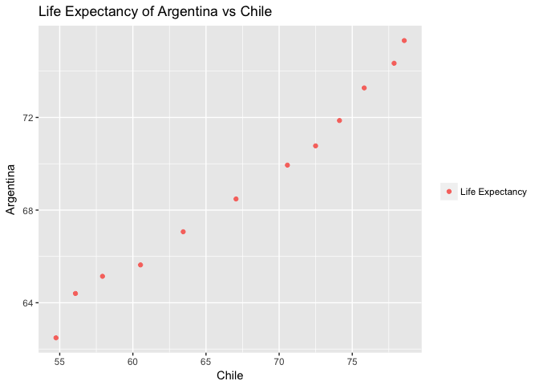

# HW04
Nathan Bendriem  
October 6, 2017  


```r
library(tidyverse)
library(gapminder)
library(tidyr)
library(knitr)
```


## Homework 4!


This week's homework is another "Pick Your Own Adventure" type where we will be working on our data wrangling skills with some aggregation and reshaping functions.

One of the prompts focuses on data reshaping while the second prompt while  focus on the join functions we have learned last week

## Part 1

### General Data Reshaping and relationship to aggregation

I will be answering the second activity: make a tibble with one row per year and columns for life expectancy for two or more countries.

Lets take the 5 countries that are closest to Antarctica and compare their life expectancies.

I start off by making a dataframe called antarctic_countries which contains Chile, Argentina, South Africa, Australia, and New Zealand and selecting the life Expectancy and year data from gapminder.  


```r
antarctic_countries2 <- gapminder %>% filter(country=="Chile" | country=="Argentina" | country=="South Africa" | country=="Australia" | country=="New Zealand") %>% select(year, country, lifeExp) %>% spread(country, lifeExp)
```


Here I used the spread function to create a table of 6 Variables measuring life Expectancy for each year listed in the Gapminder Dataset

I will use tidyr and kable functions to clean up the table, and add a title


```r
knitr::kable(antarctic_countries2, format ="html", col.names=c("Year", "Argentina", "Australia", "Chile", "New Zealand", "South Africa"), caption="Life Expectancy of Antarctic Countries")
```

<table>
<caption>Life Expectancy of Antarctic Countries</caption>
 <thead>
  <tr>
   <th style="text-align:right;"> Year </th>
   <th style="text-align:right;"> Argentina </th>
   <th style="text-align:right;"> Australia </th>
   <th style="text-align:right;"> Chile </th>
   <th style="text-align:right;"> New Zealand </th>
   <th style="text-align:right;"> South Africa </th>
  </tr>
 </thead>
<tbody>
  <tr>
   <td style="text-align:right;"> 1952 </td>
   <td style="text-align:right;"> 62.485 </td>
   <td style="text-align:right;"> 69.120 </td>
   <td style="text-align:right;"> 54.745 </td>
   <td style="text-align:right;"> 69.390 </td>
   <td style="text-align:right;"> 45.009 </td>
  </tr>
  <tr>
   <td style="text-align:right;"> 1957 </td>
   <td style="text-align:right;"> 64.399 </td>
   <td style="text-align:right;"> 70.330 </td>
   <td style="text-align:right;"> 56.074 </td>
   <td style="text-align:right;"> 70.260 </td>
   <td style="text-align:right;"> 47.985 </td>
  </tr>
  <tr>
   <td style="text-align:right;"> 1962 </td>
   <td style="text-align:right;"> 65.142 </td>
   <td style="text-align:right;"> 70.930 </td>
   <td style="text-align:right;"> 57.924 </td>
   <td style="text-align:right;"> 71.240 </td>
   <td style="text-align:right;"> 49.951 </td>
  </tr>
  <tr>
   <td style="text-align:right;"> 1967 </td>
   <td style="text-align:right;"> 65.634 </td>
   <td style="text-align:right;"> 71.100 </td>
   <td style="text-align:right;"> 60.523 </td>
   <td style="text-align:right;"> 71.520 </td>
   <td style="text-align:right;"> 51.927 </td>
  </tr>
  <tr>
   <td style="text-align:right;"> 1972 </td>
   <td style="text-align:right;"> 67.065 </td>
   <td style="text-align:right;"> 71.930 </td>
   <td style="text-align:right;"> 63.441 </td>
   <td style="text-align:right;"> 71.890 </td>
   <td style="text-align:right;"> 53.696 </td>
  </tr>
  <tr>
   <td style="text-align:right;"> 1977 </td>
   <td style="text-align:right;"> 68.481 </td>
   <td style="text-align:right;"> 73.490 </td>
   <td style="text-align:right;"> 67.052 </td>
   <td style="text-align:right;"> 72.220 </td>
   <td style="text-align:right;"> 55.527 </td>
  </tr>
  <tr>
   <td style="text-align:right;"> 1982 </td>
   <td style="text-align:right;"> 69.942 </td>
   <td style="text-align:right;"> 74.740 </td>
   <td style="text-align:right;"> 70.565 </td>
   <td style="text-align:right;"> 73.840 </td>
   <td style="text-align:right;"> 58.161 </td>
  </tr>
  <tr>
   <td style="text-align:right;"> 1987 </td>
   <td style="text-align:right;"> 70.774 </td>
   <td style="text-align:right;"> 76.320 </td>
   <td style="text-align:right;"> 72.492 </td>
   <td style="text-align:right;"> 74.320 </td>
   <td style="text-align:right;"> 60.834 </td>
  </tr>
  <tr>
   <td style="text-align:right;"> 1992 </td>
   <td style="text-align:right;"> 71.868 </td>
   <td style="text-align:right;"> 77.560 </td>
   <td style="text-align:right;"> 74.126 </td>
   <td style="text-align:right;"> 76.330 </td>
   <td style="text-align:right;"> 61.888 </td>
  </tr>
  <tr>
   <td style="text-align:right;"> 1997 </td>
   <td style="text-align:right;"> 73.275 </td>
   <td style="text-align:right;"> 78.830 </td>
   <td style="text-align:right;"> 75.816 </td>
   <td style="text-align:right;"> 77.550 </td>
   <td style="text-align:right;"> 60.236 </td>
  </tr>
  <tr>
   <td style="text-align:right;"> 2002 </td>
   <td style="text-align:right;"> 74.340 </td>
   <td style="text-align:right;"> 80.370 </td>
   <td style="text-align:right;"> 77.860 </td>
   <td style="text-align:right;"> 79.110 </td>
   <td style="text-align:right;"> 53.365 </td>
  </tr>
  <tr>
   <td style="text-align:right;"> 2007 </td>
   <td style="text-align:right;"> 75.320 </td>
   <td style="text-align:right;"> 81.235 </td>
   <td style="text-align:right;"> 78.553 </td>
   <td style="text-align:right;"> 80.204 </td>
   <td style="text-align:right;"> 49.339 </td>
  </tr>
</tbody>
</table>


Next, we will plot the life Expectancy of Argentina vs that of Chile.  I used the scale_colour_discrete function to take out the title of the legend and rename the dot from "red" to "Life Expectancy"


```r
ggplot(antarctic_countries2) + geom_point(aes(x=Chile, y=Argentina, colour= "Red")) + ggtitle("Life Expectancy of Argentina vs Chile") + scale_colour_discrete(name=NULL, labels=c("Life Expectancy"))
```

<!-- -->

## Part 2

### Join, Merge, Look Up

I created two new dataframes with a couple of shark species found in the Pacific Ocean and uploaded them to R studio using the read.csv function 


```r
setwd("~/Desktop/Stat545: R/STAT545-HWs-Bendriem-Nathan/STAT545HW4")

S_LE <- read.csv("~/Desktop/Stat545: R/STAT545-HWs-Bendriem-Nathan/STAT545HW4/shark_lifeExp.csv")

S_Loc <- read.csv("~/Desktop/Stat545: R/STAT545-HWs-Bendriem-Nathan/STAT545HW4/shark_location.csv")
```

The first dataframe has species, length in meters and life expectancy


```r
kable(S_LE, format="html")
```

<table>
 <thead>
  <tr>
   <th style="text-align:left;"> Species </th>
   <th style="text-align:right;"> Length..m. </th>
   <th style="text-align:right;"> LifeExp </th>
  </tr>
 </thead>
<tbody>
  <tr>
   <td style="text-align:left;"> Frilled </td>
   <td style="text-align:right;"> 2.00 </td>
   <td style="text-align:right;"> 25 </td>
  </tr>
  <tr>
   <td style="text-align:left;"> Sevengill </td>
   <td style="text-align:right;"> 3.00 </td>
   <td style="text-align:right;"> 50 </td>
  </tr>
  <tr>
   <td style="text-align:left;"> Sixgill </td>
   <td style="text-align:right;"> 4.80 </td>
   <td style="text-align:right;"> 80 </td>
  </tr>
  <tr>
   <td style="text-align:left;"> Prickly </td>
   <td style="text-align:right;"> 4.00 </td>
   <td style="text-align:right;"> 30 </td>
  </tr>
  <tr>
   <td style="text-align:left;"> Spiny Dogfish </td>
   <td style="text-align:right;"> 1.20 </td>
   <td style="text-align:right;"> 70 </td>
  </tr>
  <tr>
   <td style="text-align:left;"> Pygmy </td>
   <td style="text-align:right;"> 0.28 </td>
   <td style="text-align:right;"> 45 </td>
  </tr>
  <tr>
   <td style="text-align:left;"> Pacific Angel Shark </td>
   <td style="text-align:right;"> 1.50 </td>
   <td style="text-align:right;"> 25 </td>
  </tr>
  <tr>
   <td style="text-align:left;"> Horn </td>
   <td style="text-align:right;"> 1.00 </td>
   <td style="text-align:right;"> 35 </td>
  </tr>
  <tr>
   <td style="text-align:left;"> Whale </td>
   <td style="text-align:right;"> 12.65 </td>
   <td style="text-align:right;"> 30 </td>
  </tr>
  <tr>
   <td style="text-align:left;"> Nurse </td>
   <td style="text-align:right;"> 2.20 </td>
   <td style="text-align:right;"> 25 </td>
  </tr>
  <tr>
   <td style="text-align:left;"> Thresher </td>
   <td style="text-align:right;"> 6.10 </td>
   <td style="text-align:right;"> 22 </td>
  </tr>
  <tr>
   <td style="text-align:left;"> Basking </td>
   <td style="text-align:right;"> 10.00 </td>
   <td style="text-align:right;"> 50 </td>
  </tr>
  <tr>
   <td style="text-align:left;"> Mako </td>
   <td style="text-align:right;"> 4.00 </td>
   <td style="text-align:right;"> 35 </td>
  </tr>
  <tr>
   <td style="text-align:left;"> Great White </td>
   <td style="text-align:right;"> 6.40 </td>
   <td style="text-align:right;"> 70 </td>
  </tr>
</tbody>
</table>

The second dataframe has a couple of the same species, and where they are found, whether its coastal, pelagic, or benthic


```r
kable(S_Loc, format="html")
```

<table>
 <thead>
  <tr>
   <th style="text-align:left;"> Species </th>
   <th style="text-align:left;"> Location </th>
  </tr>
 </thead>
<tbody>
  <tr>
   <td style="text-align:left;"> Horn </td>
   <td style="text-align:left;"> Coastal </td>
  </tr>
  <tr>
   <td style="text-align:left;"> Frilled </td>
   <td style="text-align:left;"> Benthic </td>
  </tr>
  <tr>
   <td style="text-align:left;"> Spiny Dogfish </td>
   <td style="text-align:left;"> Coastal </td>
  </tr>
  <tr>
   <td style="text-align:left;"> Whale </td>
   <td style="text-align:left;"> Pelagic </td>
  </tr>
  <tr>
   <td style="text-align:left;"> Great White </td>
   <td style="text-align:left;"> Pelagic </td>
  </tr>
  <tr>
   <td style="text-align:left;"> Mako </td>
   <td style="text-align:left;"> Pelagic </td>
  </tr>
  <tr>
   <td style="text-align:left;"> Basking </td>
   <td style="text-align:left;"> Pelagic </td>
  </tr>
  <tr>
   <td style="text-align:left;"> Sixgill </td>
   <td style="text-align:left;"> Benthic </td>
  </tr>
</tbody>
</table>

Then I play around with the join functions with both data frames. 

# Left and Right Join

Left join will take matching rows from the second variable and add them to the first variable.  Right join will do the inverse and add matching rows from the first variable and add them to the second variable


```r
left_join(S_LE, S_Loc, by="Species") %>% kable(format="html")
```

```
## Warning: Column `Species` joining factors with different levels, coercing
## to character vector
```

<table>
 <thead>
  <tr>
   <th style="text-align:left;"> Species </th>
   <th style="text-align:right;"> Length..m. </th>
   <th style="text-align:right;"> LifeExp </th>
   <th style="text-align:left;"> Location </th>
  </tr>
 </thead>
<tbody>
  <tr>
   <td style="text-align:left;"> Frilled </td>
   <td style="text-align:right;"> 2.00 </td>
   <td style="text-align:right;"> 25 </td>
   <td style="text-align:left;"> Benthic </td>
  </tr>
  <tr>
   <td style="text-align:left;"> Sevengill </td>
   <td style="text-align:right;"> 3.00 </td>
   <td style="text-align:right;"> 50 </td>
   <td style="text-align:left;"> NA </td>
  </tr>
  <tr>
   <td style="text-align:left;"> Sixgill </td>
   <td style="text-align:right;"> 4.80 </td>
   <td style="text-align:right;"> 80 </td>
   <td style="text-align:left;"> Benthic </td>
  </tr>
  <tr>
   <td style="text-align:left;"> Prickly </td>
   <td style="text-align:right;"> 4.00 </td>
   <td style="text-align:right;"> 30 </td>
   <td style="text-align:left;"> NA </td>
  </tr>
  <tr>
   <td style="text-align:left;"> Spiny Dogfish </td>
   <td style="text-align:right;"> 1.20 </td>
   <td style="text-align:right;"> 70 </td>
   <td style="text-align:left;"> Coastal </td>
  </tr>
  <tr>
   <td style="text-align:left;"> Pygmy </td>
   <td style="text-align:right;"> 0.28 </td>
   <td style="text-align:right;"> 45 </td>
   <td style="text-align:left;"> NA </td>
  </tr>
  <tr>
   <td style="text-align:left;"> Pacific Angel Shark </td>
   <td style="text-align:right;"> 1.50 </td>
   <td style="text-align:right;"> 25 </td>
   <td style="text-align:left;"> NA </td>
  </tr>
  <tr>
   <td style="text-align:left;"> Horn </td>
   <td style="text-align:right;"> 1.00 </td>
   <td style="text-align:right;"> 35 </td>
   <td style="text-align:left;"> Coastal </td>
  </tr>
  <tr>
   <td style="text-align:left;"> Whale </td>
   <td style="text-align:right;"> 12.65 </td>
   <td style="text-align:right;"> 30 </td>
   <td style="text-align:left;"> Pelagic </td>
  </tr>
  <tr>
   <td style="text-align:left;"> Nurse </td>
   <td style="text-align:right;"> 2.20 </td>
   <td style="text-align:right;"> 25 </td>
   <td style="text-align:left;"> NA </td>
  </tr>
  <tr>
   <td style="text-align:left;"> Thresher </td>
   <td style="text-align:right;"> 6.10 </td>
   <td style="text-align:right;"> 22 </td>
   <td style="text-align:left;"> NA </td>
  </tr>
  <tr>
   <td style="text-align:left;"> Basking </td>
   <td style="text-align:right;"> 10.00 </td>
   <td style="text-align:right;"> 50 </td>
   <td style="text-align:left;"> Pelagic </td>
  </tr>
  <tr>
   <td style="text-align:left;"> Mako </td>
   <td style="text-align:right;"> 4.00 </td>
   <td style="text-align:right;"> 35 </td>
   <td style="text-align:left;"> Pelagic </td>
  </tr>
  <tr>
   <td style="text-align:left;"> Great White </td>
   <td style="text-align:right;"> 6.40 </td>
   <td style="text-align:right;"> 70 </td>
   <td style="text-align:left;"> Pelagic </td>
  </tr>
</tbody>
</table>

Here, all species of sharks are presented and those the corresponding location for the sharks found in S_LE and not in S_Loc come up as "NA"


```r
right_join(S_LE, S_Loc, by="Species") %>% kable(format="html")
```

```
## Warning: Column `Species` joining factors with different levels, coercing
## to character vector
```

<table>
 <thead>
  <tr>
   <th style="text-align:left;"> Species </th>
   <th style="text-align:right;"> Length..m. </th>
   <th style="text-align:right;"> LifeExp </th>
   <th style="text-align:left;"> Location </th>
  </tr>
 </thead>
<tbody>
  <tr>
   <td style="text-align:left;"> Horn </td>
   <td style="text-align:right;"> 1.00 </td>
   <td style="text-align:right;"> 35 </td>
   <td style="text-align:left;"> Coastal </td>
  </tr>
  <tr>
   <td style="text-align:left;"> Frilled </td>
   <td style="text-align:right;"> 2.00 </td>
   <td style="text-align:right;"> 25 </td>
   <td style="text-align:left;"> Benthic </td>
  </tr>
  <tr>
   <td style="text-align:left;"> Spiny Dogfish </td>
   <td style="text-align:right;"> 1.20 </td>
   <td style="text-align:right;"> 70 </td>
   <td style="text-align:left;"> Coastal </td>
  </tr>
  <tr>
   <td style="text-align:left;"> Whale </td>
   <td style="text-align:right;"> 12.65 </td>
   <td style="text-align:right;"> 30 </td>
   <td style="text-align:left;"> Pelagic </td>
  </tr>
  <tr>
   <td style="text-align:left;"> Great White </td>
   <td style="text-align:right;"> 6.40 </td>
   <td style="text-align:right;"> 70 </td>
   <td style="text-align:left;"> Pelagic </td>
  </tr>
  <tr>
   <td style="text-align:left;"> Mako </td>
   <td style="text-align:right;"> 4.00 </td>
   <td style="text-align:right;"> 35 </td>
   <td style="text-align:left;"> Pelagic </td>
  </tr>
  <tr>
   <td style="text-align:left;"> Basking </td>
   <td style="text-align:right;"> 10.00 </td>
   <td style="text-align:right;"> 50 </td>
   <td style="text-align:left;"> Pelagic </td>
  </tr>
  <tr>
   <td style="text-align:left;"> Sixgill </td>
   <td style="text-align:right;"> 4.80 </td>
   <td style="text-align:right;"> 80 </td>
   <td style="text-align:left;"> Benthic </td>
  </tr>
</tbody>
</table>

As you can see, in the right join, only the species that are found in the S_Loc dataframe are depicted.  


# Inner and Full Join

Inner and Full join will work with rows instead of columns.  Rows that match from both dataframes will be retained with inner join and those that are not found in both dataframes are not shown. 

Full join will retain all rows regardless of if it has a match in both dataframes.  

For inner_join, only the species of sharks found in both dataframes are shown


```r
inner_join(S_LE, S_Loc, by="Species") %>% kable()
```

```
## Warning: Column `Species` joining factors with different levels, coercing
## to character vector
```


Species          Length..m.   LifeExp  Location 
--------------  -----------  --------  ---------
Frilled                2.00        25  Benthic  
Sixgill                4.80        80  Benthic  
Spiny Dogfish          1.20        70  Coastal  
Horn                   1.00        35  Coastal  
Whale                 12.65        30  Pelagic  
Basking               10.00        50  Pelagic  
Mako                   4.00        35  Pelagic  
Great White            6.40        70  Pelagic  


If using full join, all species of sharks are shown and all columns are shown as well.  NAs signify missing data from the S_Loc dataframe where the species of shark was not included in the dataframe


```r
full_join(S_LE, S_Loc, by="Species") %>% kable()
```

```
## Warning: Column `Species` joining factors with different levels, coercing
## to character vector
```


Species                Length..m.   LifeExp  Location 
--------------------  -----------  --------  ---------
Frilled                      2.00        25  Benthic  
Sevengill                    3.00        50  NA       
Sixgill                      4.80        80  Benthic  
Prickly                      4.00        30  NA       
Spiny Dogfish                1.20        70  Coastal  
Pygmy                        0.28        45  NA       
Pacific Angel Shark          1.50        25  NA       
Horn                         1.00        35  Coastal  
Whale                       12.65        30  Pelagic  
Nurse                        2.20        25  NA       
Thresher                     6.10        22  NA       
Basking                     10.00        50  Pelagic  
Mako                         4.00        35  Pelagic  
Great White                  6.40        70  Pelagic  


# Semi and Anti Join

Semi join does not actually join one column to another data frame but will filter out all rows in the first dataframe that have a match in the second data frame.  Anti join does the opposite and only shows the rows that in the first dataframe that are not matched in the second dataframe


```r
semi_join(S_LE, S_Loc, by="Species") %>% kable()
```

```
## Warning: Column `Species` joining factors with different levels, coercing
## to character vector
```


Species          Length..m.   LifeExp
--------------  -----------  --------
Frilled                2.00        25
Sixgill                4.80        80
Spiny Dogfish          1.20        70
Horn                   1.00        35
Whale                 12.65        30
Basking               10.00        50
Mako                   4.00        35
Great White            6.40        70

Here only the sharks found in both dataframes are shown, but since S_LE was the first dataframe, its columns are retained


If we inverse the two dataframes we get this:


```r
semi_join(S_Loc, S_LE, by="Species") %>% kable()
```

```
## Warning: Column `Species` joining factors with different levels, coercing
## to character vector
```


Species         Location 
--------------  ---------
Horn            Coastal  
Frilled         Benthic  
Spiny Dogfish   Coastal  
Whale           Pelagic  
Great White     Pelagic  
Mako            Pelagic  
Basking         Pelagic  
Sixgill         Benthic  

Once again, only the sharks found in both dataframes are shown, but the column comes from the S_Loc dataframe since it is the first variable


For the anti_join function, only the sharks that are not found in both databases are depicted


```r
anti_join(S_LE, S_Loc, by="Species") %>% kable()
```

```
## Warning: Column `Species` joining factors with different levels, coercing
## to character vector
```


Species                Length..m.   LifeExp
--------------------  -----------  --------
Sevengill                    3.00        50
Prickly                      4.00        30
Pygmy                        0.28        45
Pacific Angel Shark          1.50        25
Nurse                        2.20        25
Thresher                     6.10        22

# Binding

The binding function will addd either rows (bind_rows) or columns (bind_columns) into a new dataframe

By binding rows, I am adding all shark species and some will be duplicated if they are found in both dataframes


```r
bind_rows(S_LE, S_Loc) %>% kable()
```

```
## Warning in bind_rows_(x, .id): Unequal factor levels: coercing to character
```

```
## Warning in bind_rows_(x, .id): binding character and factor vector,
## coercing into character vector

## Warning in bind_rows_(x, .id): binding character and factor vector,
## coercing into character vector
```


Species                Length..m.   LifeExp  Location 
--------------------  -----------  --------  ---------
Frilled                      2.00        25  NA       
Sevengill                    3.00        50  NA       
Sixgill                      4.80        80  NA       
Prickly                      4.00        30  NA       
Spiny Dogfish                1.20        70  NA       
Pygmy                        0.28        45  NA       
Pacific Angel Shark          1.50        25  NA       
Horn                         1.00        35  NA       
Whale                       12.65        30  NA       
Nurse                        2.20        25  NA       
Thresher                     6.10        22  NA       
Basking                     10.00        50  NA       
Mako                         4.00        35  NA       
Great White                  6.40        70  NA       
Horn                           NA        NA  Coastal  
Frilled                        NA        NA  Benthic  
Spiny Dogfish                  NA        NA  Coastal  
Whale                          NA        NA  Pelagic  
Great White                    NA        NA  Pelagic  
Mako                           NA        NA  Pelagic  
Basking                        NA        NA  Pelagic  
Sixgill                        NA        NA  Benthic  

Bind columns requires that each dataframe have the same number of rows or else it does not work.  In this case, S_LE has 14 observations and S_LOC has 8 so bind.columns will not work.


## Reflection on the Homework

For the first part of the homework, I relied mostly on the class notes and a little trial and error on creating the ggplot.  

The second part of the homework took much longer to complete, but mostly because we have not had much work with the join and binding functions yet.  
Uploading the new dataframes was difficult as I had to pinpoint the right working directory before it would upload. 

In terms of the join functions, I relied heavily on the data wrangling cheatsheet found [here](https://www.rstudio.com/wp-content/uploads/2015/02/data-wrangling-cheatsheet.pdf)

I am still having trouble hiding the library code chunk at the top of the page if anyone could help me out with that!  I have tried include=FALSE, warning=FALSE, message=FALSE, results='hide', echo=FALSE, cache=FALSE with no luck....


