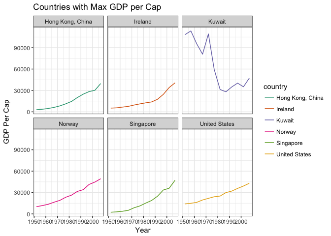
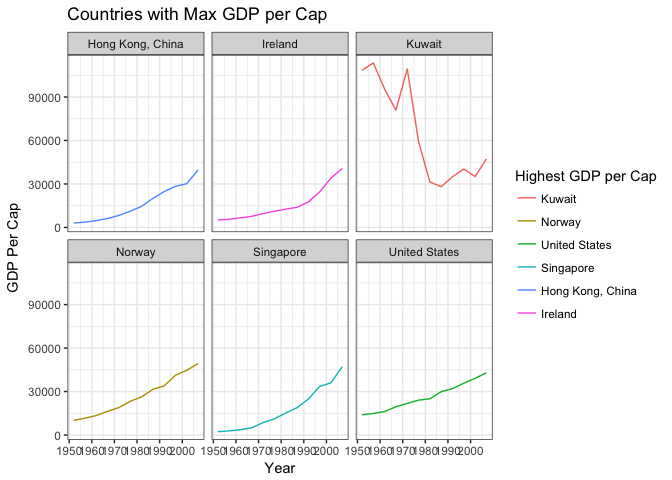
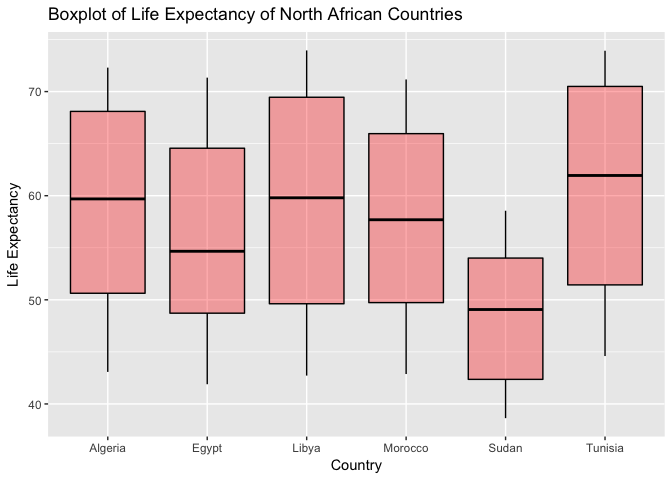
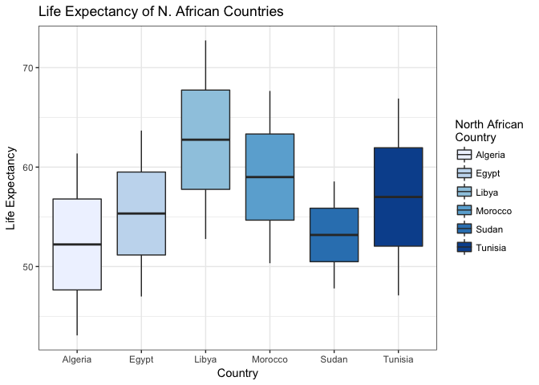

# HW05
Nathan Bendriem  
October 14, 2017  


# WELCOME! to the fifth and final homework assignment for STAT545

The goals for this homework are:
- Reorder a fctor in a principled way based on the data and demonstrate the effect in arranged data and figures
- Improve a figure using new knowledge
- Implement visualtion design principles
-  Write some data to file and load it back into R
- Organize my Github as a final goodbye 

Lets get right into it!

## Factor Management

To go full circle, I decided to go back to the gapminder dataset since we've been focusing a lot on the singer dataframes in class lately.

Step goals:
- Define factor variables
- Drop factor/levels
- Reorder levels based on knowledge from data

### Drop Oceania

First lets look at the original gapminder dataframe


```r
nrow(gapminder)
```

```
## [1] 1704
```

```r
levels(gapminder$continent)
```

```
## [1] "Africa"   "Americas" "Asia"     "Europe"   "Oceania"
```

and lets look at the number of observations in Oceania


```r
Oceania <- gapminder %>% filter(continent=="Oceania")

str(Oceania)
```

```
## Classes 'tbl_df', 'tbl' and 'data.frame':	24 obs. of  6 variables:
##  $ country  : Factor w/ 142 levels "Afghanistan",..: 6 6 6 6 6 6 6 6 6 6 ...
##  $ continent: Factor w/ 5 levels "Africa","Americas",..: 5 5 5 5 5 5 5 5 5 5 ...
##  $ year     : int  1952 1957 1962 1967 1972 1977 1982 1987 1992 1997 ...
##  $ lifeExp  : num  69.1 70.3 70.9 71.1 71.9 ...
##  $ pop      : int  8691212 9712569 10794968 11872264 13177000 14074100 15184200 16257249 17481977 18565243 ...
##  $ gdpPercap: num  10040 10950 12217 14526 16789 ...
```

Oceania has 24 observations in the gapminder dataset

Next we will drop the factor Oceania


```r
ByeOceania <- gapminder %>% filter(continent != "Oceania") %>% droplevels()
```

Now lets check the numbers of rows in Gapminder, it should be 24 observations less than the original gapminder


```r
nrow(ByeOceania)
```

```
## [1] 1680
```

```r
levels(ByeOceania$continent)
```

```
## [1] "Africa"   "Americas" "Asia"     "Europe"
```

```r
str(ByeOceania)
```

```
## Classes 'tbl_df', 'tbl' and 'data.frame':	1680 obs. of  6 variables:
##  $ country  : Factor w/ 140 levels "Afghanistan",..: 1 1 1 1 1 1 1 1 1 1 ...
##  $ continent: Factor w/ 4 levels "Africa","Americas",..: 3 3 3 3 3 3 3 3 3 3 ...
##  $ year     : int  1952 1957 1962 1967 1972 1977 1982 1987 1992 1997 ...
##  $ lifeExp  : num  28.8 30.3 32 34 36.1 ...
##  $ pop      : int  8425333 9240934 10267083 11537966 13079460 14880372 12881816 13867957 16317921 22227415 ...
##  $ gdpPercap: num  779 821 853 836 740 ...
```

```r
forcats::fct_count(ByeOceania$continent)
```

```
## # A tibble: 4 x 2
##          f     n
##     <fctr> <int>
## 1   Africa   624
## 2 Americas   300
## 3     Asia   396
## 4   Europe   360
```


```r
ContinentReOrder <- fct_reorder(ByeOceania$country, ByeOceania$gdpPercap, max, .desc= TRUE) %>% levels() %>% head()
```


```r
MaxGDP <- ByeOceania %>% filter(country %in% ContinentReOrder) %>% select(year, country, gdpPercap)
```


```r
ggplot(MaxGDP, aes(year, gdpPercap, colour= country)) + facet_wrap(~country) + geom_line() + scale_colour_brewer(palette="Dark2") + labs(x= "Year", y= "GDP Per Cap", title="Countries with Max GDP per Cap") + theme_bw()
```

<!-- -->


```r
MaxGDP %>% group_by(country) %>% knitr::kable(format="html")
```

<table>
 <thead>
  <tr>
   <th style="text-align:right;"> year </th>
   <th style="text-align:left;"> country </th>
   <th style="text-align:right;"> gdpPercap </th>
  </tr>
 </thead>
<tbody>
  <tr>
   <td style="text-align:right;"> 1952 </td>
   <td style="text-align:left;"> Hong Kong, China </td>
   <td style="text-align:right;"> 3054.421 </td>
  </tr>
  <tr>
   <td style="text-align:right;"> 1957 </td>
   <td style="text-align:left;"> Hong Kong, China </td>
   <td style="text-align:right;"> 3629.076 </td>
  </tr>
  <tr>
   <td style="text-align:right;"> 1962 </td>
   <td style="text-align:left;"> Hong Kong, China </td>
   <td style="text-align:right;"> 4692.648 </td>
  </tr>
  <tr>
   <td style="text-align:right;"> 1967 </td>
   <td style="text-align:left;"> Hong Kong, China </td>
   <td style="text-align:right;"> 6197.963 </td>
  </tr>
  <tr>
   <td style="text-align:right;"> 1972 </td>
   <td style="text-align:left;"> Hong Kong, China </td>
   <td style="text-align:right;"> 8315.928 </td>
  </tr>
  <tr>
   <td style="text-align:right;"> 1977 </td>
   <td style="text-align:left;"> Hong Kong, China </td>
   <td style="text-align:right;"> 11186.141 </td>
  </tr>
  <tr>
   <td style="text-align:right;"> 1982 </td>
   <td style="text-align:left;"> Hong Kong, China </td>
   <td style="text-align:right;"> 14560.531 </td>
  </tr>
  <tr>
   <td style="text-align:right;"> 1987 </td>
   <td style="text-align:left;"> Hong Kong, China </td>
   <td style="text-align:right;"> 20038.473 </td>
  </tr>
  <tr>
   <td style="text-align:right;"> 1992 </td>
   <td style="text-align:left;"> Hong Kong, China </td>
   <td style="text-align:right;"> 24757.603 </td>
  </tr>
  <tr>
   <td style="text-align:right;"> 1997 </td>
   <td style="text-align:left;"> Hong Kong, China </td>
   <td style="text-align:right;"> 28377.632 </td>
  </tr>
  <tr>
   <td style="text-align:right;"> 2002 </td>
   <td style="text-align:left;"> Hong Kong, China </td>
   <td style="text-align:right;"> 30209.015 </td>
  </tr>
  <tr>
   <td style="text-align:right;"> 2007 </td>
   <td style="text-align:left;"> Hong Kong, China </td>
   <td style="text-align:right;"> 39724.979 </td>
  </tr>
  <tr>
   <td style="text-align:right;"> 1952 </td>
   <td style="text-align:left;"> Ireland </td>
   <td style="text-align:right;"> 5210.280 </td>
  </tr>
  <tr>
   <td style="text-align:right;"> 1957 </td>
   <td style="text-align:left;"> Ireland </td>
   <td style="text-align:right;"> 5599.078 </td>
  </tr>
  <tr>
   <td style="text-align:right;"> 1962 </td>
   <td style="text-align:left;"> Ireland </td>
   <td style="text-align:right;"> 6631.597 </td>
  </tr>
  <tr>
   <td style="text-align:right;"> 1967 </td>
   <td style="text-align:left;"> Ireland </td>
   <td style="text-align:right;"> 7655.569 </td>
  </tr>
  <tr>
   <td style="text-align:right;"> 1972 </td>
   <td style="text-align:left;"> Ireland </td>
   <td style="text-align:right;"> 9530.773 </td>
  </tr>
  <tr>
   <td style="text-align:right;"> 1977 </td>
   <td style="text-align:left;"> Ireland </td>
   <td style="text-align:right;"> 11150.981 </td>
  </tr>
  <tr>
   <td style="text-align:right;"> 1982 </td>
   <td style="text-align:left;"> Ireland </td>
   <td style="text-align:right;"> 12618.321 </td>
  </tr>
  <tr>
   <td style="text-align:right;"> 1987 </td>
   <td style="text-align:left;"> Ireland </td>
   <td style="text-align:right;"> 13872.867 </td>
  </tr>
  <tr>
   <td style="text-align:right;"> 1992 </td>
   <td style="text-align:left;"> Ireland </td>
   <td style="text-align:right;"> 17558.816 </td>
  </tr>
  <tr>
   <td style="text-align:right;"> 1997 </td>
   <td style="text-align:left;"> Ireland </td>
   <td style="text-align:right;"> 24521.947 </td>
  </tr>
  <tr>
   <td style="text-align:right;"> 2002 </td>
   <td style="text-align:left;"> Ireland </td>
   <td style="text-align:right;"> 34077.049 </td>
  </tr>
  <tr>
   <td style="text-align:right;"> 2007 </td>
   <td style="text-align:left;"> Ireland </td>
   <td style="text-align:right;"> 40675.996 </td>
  </tr>
  <tr>
   <td style="text-align:right;"> 1952 </td>
   <td style="text-align:left;"> Kuwait </td>
   <td style="text-align:right;"> 108382.353 </td>
  </tr>
  <tr>
   <td style="text-align:right;"> 1957 </td>
   <td style="text-align:left;"> Kuwait </td>
   <td style="text-align:right;"> 113523.133 </td>
  </tr>
  <tr>
   <td style="text-align:right;"> 1962 </td>
   <td style="text-align:left;"> Kuwait </td>
   <td style="text-align:right;"> 95458.112 </td>
  </tr>
  <tr>
   <td style="text-align:right;"> 1967 </td>
   <td style="text-align:left;"> Kuwait </td>
   <td style="text-align:right;"> 80894.883 </td>
  </tr>
  <tr>
   <td style="text-align:right;"> 1972 </td>
   <td style="text-align:left;"> Kuwait </td>
   <td style="text-align:right;"> 109347.867 </td>
  </tr>
  <tr>
   <td style="text-align:right;"> 1977 </td>
   <td style="text-align:left;"> Kuwait </td>
   <td style="text-align:right;"> 59265.477 </td>
  </tr>
  <tr>
   <td style="text-align:right;"> 1982 </td>
   <td style="text-align:left;"> Kuwait </td>
   <td style="text-align:right;"> 31354.036 </td>
  </tr>
  <tr>
   <td style="text-align:right;"> 1987 </td>
   <td style="text-align:left;"> Kuwait </td>
   <td style="text-align:right;"> 28118.430 </td>
  </tr>
  <tr>
   <td style="text-align:right;"> 1992 </td>
   <td style="text-align:left;"> Kuwait </td>
   <td style="text-align:right;"> 34932.920 </td>
  </tr>
  <tr>
   <td style="text-align:right;"> 1997 </td>
   <td style="text-align:left;"> Kuwait </td>
   <td style="text-align:right;"> 40300.620 </td>
  </tr>
  <tr>
   <td style="text-align:right;"> 2002 </td>
   <td style="text-align:left;"> Kuwait </td>
   <td style="text-align:right;"> 35110.106 </td>
  </tr>
  <tr>
   <td style="text-align:right;"> 2007 </td>
   <td style="text-align:left;"> Kuwait </td>
   <td style="text-align:right;"> 47306.990 </td>
  </tr>
  <tr>
   <td style="text-align:right;"> 1952 </td>
   <td style="text-align:left;"> Norway </td>
   <td style="text-align:right;"> 10095.422 </td>
  </tr>
  <tr>
   <td style="text-align:right;"> 1957 </td>
   <td style="text-align:left;"> Norway </td>
   <td style="text-align:right;"> 11653.973 </td>
  </tr>
  <tr>
   <td style="text-align:right;"> 1962 </td>
   <td style="text-align:left;"> Norway </td>
   <td style="text-align:right;"> 13450.402 </td>
  </tr>
  <tr>
   <td style="text-align:right;"> 1967 </td>
   <td style="text-align:left;"> Norway </td>
   <td style="text-align:right;"> 16361.876 </td>
  </tr>
  <tr>
   <td style="text-align:right;"> 1972 </td>
   <td style="text-align:left;"> Norway </td>
   <td style="text-align:right;"> 18965.056 </td>
  </tr>
  <tr>
   <td style="text-align:right;"> 1977 </td>
   <td style="text-align:left;"> Norway </td>
   <td style="text-align:right;"> 23311.349 </td>
  </tr>
  <tr>
   <td style="text-align:right;"> 1982 </td>
   <td style="text-align:left;"> Norway </td>
   <td style="text-align:right;"> 26298.635 </td>
  </tr>
  <tr>
   <td style="text-align:right;"> 1987 </td>
   <td style="text-align:left;"> Norway </td>
   <td style="text-align:right;"> 31540.975 </td>
  </tr>
  <tr>
   <td style="text-align:right;"> 1992 </td>
   <td style="text-align:left;"> Norway </td>
   <td style="text-align:right;"> 33965.661 </td>
  </tr>
  <tr>
   <td style="text-align:right;"> 1997 </td>
   <td style="text-align:left;"> Norway </td>
   <td style="text-align:right;"> 41283.164 </td>
  </tr>
  <tr>
   <td style="text-align:right;"> 2002 </td>
   <td style="text-align:left;"> Norway </td>
   <td style="text-align:right;"> 44683.975 </td>
  </tr>
  <tr>
   <td style="text-align:right;"> 2007 </td>
   <td style="text-align:left;"> Norway </td>
   <td style="text-align:right;"> 49357.190 </td>
  </tr>
  <tr>
   <td style="text-align:right;"> 1952 </td>
   <td style="text-align:left;"> Singapore </td>
   <td style="text-align:right;"> 2315.138 </td>
  </tr>
  <tr>
   <td style="text-align:right;"> 1957 </td>
   <td style="text-align:left;"> Singapore </td>
   <td style="text-align:right;"> 2843.104 </td>
  </tr>
  <tr>
   <td style="text-align:right;"> 1962 </td>
   <td style="text-align:left;"> Singapore </td>
   <td style="text-align:right;"> 3674.736 </td>
  </tr>
  <tr>
   <td style="text-align:right;"> 1967 </td>
   <td style="text-align:left;"> Singapore </td>
   <td style="text-align:right;"> 4977.419 </td>
  </tr>
  <tr>
   <td style="text-align:right;"> 1972 </td>
   <td style="text-align:left;"> Singapore </td>
   <td style="text-align:right;"> 8597.756 </td>
  </tr>
  <tr>
   <td style="text-align:right;"> 1977 </td>
   <td style="text-align:left;"> Singapore </td>
   <td style="text-align:right;"> 11210.089 </td>
  </tr>
  <tr>
   <td style="text-align:right;"> 1982 </td>
   <td style="text-align:left;"> Singapore </td>
   <td style="text-align:right;"> 15169.161 </td>
  </tr>
  <tr>
   <td style="text-align:right;"> 1987 </td>
   <td style="text-align:left;"> Singapore </td>
   <td style="text-align:right;"> 18861.531 </td>
  </tr>
  <tr>
   <td style="text-align:right;"> 1992 </td>
   <td style="text-align:left;"> Singapore </td>
   <td style="text-align:right;"> 24769.891 </td>
  </tr>
  <tr>
   <td style="text-align:right;"> 1997 </td>
   <td style="text-align:left;"> Singapore </td>
   <td style="text-align:right;"> 33519.477 </td>
  </tr>
  <tr>
   <td style="text-align:right;"> 2002 </td>
   <td style="text-align:left;"> Singapore </td>
   <td style="text-align:right;"> 36023.105 </td>
  </tr>
  <tr>
   <td style="text-align:right;"> 2007 </td>
   <td style="text-align:left;"> Singapore </td>
   <td style="text-align:right;"> 47143.180 </td>
  </tr>
  <tr>
   <td style="text-align:right;"> 1952 </td>
   <td style="text-align:left;"> United States </td>
   <td style="text-align:right;"> 13990.482 </td>
  </tr>
  <tr>
   <td style="text-align:right;"> 1957 </td>
   <td style="text-align:left;"> United States </td>
   <td style="text-align:right;"> 14847.127 </td>
  </tr>
  <tr>
   <td style="text-align:right;"> 1962 </td>
   <td style="text-align:left;"> United States </td>
   <td style="text-align:right;"> 16173.146 </td>
  </tr>
  <tr>
   <td style="text-align:right;"> 1967 </td>
   <td style="text-align:left;"> United States </td>
   <td style="text-align:right;"> 19530.366 </td>
  </tr>
  <tr>
   <td style="text-align:right;"> 1972 </td>
   <td style="text-align:left;"> United States </td>
   <td style="text-align:right;"> 21806.036 </td>
  </tr>
  <tr>
   <td style="text-align:right;"> 1977 </td>
   <td style="text-align:left;"> United States </td>
   <td style="text-align:right;"> 24072.632 </td>
  </tr>
  <tr>
   <td style="text-align:right;"> 1982 </td>
   <td style="text-align:left;"> United States </td>
   <td style="text-align:right;"> 25009.559 </td>
  </tr>
  <tr>
   <td style="text-align:right;"> 1987 </td>
   <td style="text-align:left;"> United States </td>
   <td style="text-align:right;"> 29884.350 </td>
  </tr>
  <tr>
   <td style="text-align:right;"> 1992 </td>
   <td style="text-align:left;"> United States </td>
   <td style="text-align:right;"> 32003.932 </td>
  </tr>
  <tr>
   <td style="text-align:right;"> 1997 </td>
   <td style="text-align:left;"> United States </td>
   <td style="text-align:right;"> 35767.433 </td>
  </tr>
  <tr>
   <td style="text-align:right;"> 2002 </td>
   <td style="text-align:left;"> United States </td>
   <td style="text-align:right;"> 39097.100 </td>
  </tr>
  <tr>
   <td style="text-align:right;"> 2007 </td>
   <td style="text-align:left;"> United States </td>
   <td style="text-align:right;"> 42951.653 </td>
  </tr>
</tbody>
</table>


Shown above, it is arragned in alphabetical order by country

And the plot looks like this:


```r
ggplot(MaxGDP, aes(year, gdpPercap, colour= country)) + facet_wrap(~country) + geom_line() + scale_colour_brewer(palette="Dark2") + labs(x= "Year", y= "GDP Per Cap", title="Countries with Max GDP per Cap") + theme_bw()
```

<!-- -->

Now we re-arrange the dataframe to descend in terms of GDP per Cap


```r
AsceMaxGDP <- MaxGDP %>% group_by(country) %>% arrange(desc(gdpPercap))
knitr::kable(AsceMaxGDP, format="html")
```

<table>
 <thead>
  <tr>
   <th style="text-align:right;"> year </th>
   <th style="text-align:left;"> country </th>
   <th style="text-align:right;"> gdpPercap </th>
  </tr>
 </thead>
<tbody>
  <tr>
   <td style="text-align:right;"> 1957 </td>
   <td style="text-align:left;"> Kuwait </td>
   <td style="text-align:right;"> 113523.133 </td>
  </tr>
  <tr>
   <td style="text-align:right;"> 1972 </td>
   <td style="text-align:left;"> Kuwait </td>
   <td style="text-align:right;"> 109347.867 </td>
  </tr>
  <tr>
   <td style="text-align:right;"> 1952 </td>
   <td style="text-align:left;"> Kuwait </td>
   <td style="text-align:right;"> 108382.353 </td>
  </tr>
  <tr>
   <td style="text-align:right;"> 1962 </td>
   <td style="text-align:left;"> Kuwait </td>
   <td style="text-align:right;"> 95458.112 </td>
  </tr>
  <tr>
   <td style="text-align:right;"> 1967 </td>
   <td style="text-align:left;"> Kuwait </td>
   <td style="text-align:right;"> 80894.883 </td>
  </tr>
  <tr>
   <td style="text-align:right;"> 1977 </td>
   <td style="text-align:left;"> Kuwait </td>
   <td style="text-align:right;"> 59265.477 </td>
  </tr>
  <tr>
   <td style="text-align:right;"> 2007 </td>
   <td style="text-align:left;"> Norway </td>
   <td style="text-align:right;"> 49357.190 </td>
  </tr>
  <tr>
   <td style="text-align:right;"> 2007 </td>
   <td style="text-align:left;"> Kuwait </td>
   <td style="text-align:right;"> 47306.990 </td>
  </tr>
  <tr>
   <td style="text-align:right;"> 2007 </td>
   <td style="text-align:left;"> Singapore </td>
   <td style="text-align:right;"> 47143.180 </td>
  </tr>
  <tr>
   <td style="text-align:right;"> 2002 </td>
   <td style="text-align:left;"> Norway </td>
   <td style="text-align:right;"> 44683.975 </td>
  </tr>
  <tr>
   <td style="text-align:right;"> 2007 </td>
   <td style="text-align:left;"> United States </td>
   <td style="text-align:right;"> 42951.653 </td>
  </tr>
  <tr>
   <td style="text-align:right;"> 1997 </td>
   <td style="text-align:left;"> Norway </td>
   <td style="text-align:right;"> 41283.164 </td>
  </tr>
  <tr>
   <td style="text-align:right;"> 2007 </td>
   <td style="text-align:left;"> Ireland </td>
   <td style="text-align:right;"> 40675.996 </td>
  </tr>
  <tr>
   <td style="text-align:right;"> 1997 </td>
   <td style="text-align:left;"> Kuwait </td>
   <td style="text-align:right;"> 40300.620 </td>
  </tr>
  <tr>
   <td style="text-align:right;"> 2007 </td>
   <td style="text-align:left;"> Hong Kong, China </td>
   <td style="text-align:right;"> 39724.979 </td>
  </tr>
  <tr>
   <td style="text-align:right;"> 2002 </td>
   <td style="text-align:left;"> United States </td>
   <td style="text-align:right;"> 39097.100 </td>
  </tr>
  <tr>
   <td style="text-align:right;"> 2002 </td>
   <td style="text-align:left;"> Singapore </td>
   <td style="text-align:right;"> 36023.105 </td>
  </tr>
  <tr>
   <td style="text-align:right;"> 1997 </td>
   <td style="text-align:left;"> United States </td>
   <td style="text-align:right;"> 35767.433 </td>
  </tr>
  <tr>
   <td style="text-align:right;"> 2002 </td>
   <td style="text-align:left;"> Kuwait </td>
   <td style="text-align:right;"> 35110.106 </td>
  </tr>
  <tr>
   <td style="text-align:right;"> 1992 </td>
   <td style="text-align:left;"> Kuwait </td>
   <td style="text-align:right;"> 34932.920 </td>
  </tr>
  <tr>
   <td style="text-align:right;"> 2002 </td>
   <td style="text-align:left;"> Ireland </td>
   <td style="text-align:right;"> 34077.049 </td>
  </tr>
  <tr>
   <td style="text-align:right;"> 1992 </td>
   <td style="text-align:left;"> Norway </td>
   <td style="text-align:right;"> 33965.661 </td>
  </tr>
  <tr>
   <td style="text-align:right;"> 1997 </td>
   <td style="text-align:left;"> Singapore </td>
   <td style="text-align:right;"> 33519.477 </td>
  </tr>
  <tr>
   <td style="text-align:right;"> 1992 </td>
   <td style="text-align:left;"> United States </td>
   <td style="text-align:right;"> 32003.932 </td>
  </tr>
  <tr>
   <td style="text-align:right;"> 1987 </td>
   <td style="text-align:left;"> Norway </td>
   <td style="text-align:right;"> 31540.975 </td>
  </tr>
  <tr>
   <td style="text-align:right;"> 1982 </td>
   <td style="text-align:left;"> Kuwait </td>
   <td style="text-align:right;"> 31354.036 </td>
  </tr>
  <tr>
   <td style="text-align:right;"> 2002 </td>
   <td style="text-align:left;"> Hong Kong, China </td>
   <td style="text-align:right;"> 30209.015 </td>
  </tr>
  <tr>
   <td style="text-align:right;"> 1987 </td>
   <td style="text-align:left;"> United States </td>
   <td style="text-align:right;"> 29884.350 </td>
  </tr>
  <tr>
   <td style="text-align:right;"> 1997 </td>
   <td style="text-align:left;"> Hong Kong, China </td>
   <td style="text-align:right;"> 28377.632 </td>
  </tr>
  <tr>
   <td style="text-align:right;"> 1987 </td>
   <td style="text-align:left;"> Kuwait </td>
   <td style="text-align:right;"> 28118.430 </td>
  </tr>
  <tr>
   <td style="text-align:right;"> 1982 </td>
   <td style="text-align:left;"> Norway </td>
   <td style="text-align:right;"> 26298.635 </td>
  </tr>
  <tr>
   <td style="text-align:right;"> 1982 </td>
   <td style="text-align:left;"> United States </td>
   <td style="text-align:right;"> 25009.559 </td>
  </tr>
  <tr>
   <td style="text-align:right;"> 1992 </td>
   <td style="text-align:left;"> Singapore </td>
   <td style="text-align:right;"> 24769.891 </td>
  </tr>
  <tr>
   <td style="text-align:right;"> 1992 </td>
   <td style="text-align:left;"> Hong Kong, China </td>
   <td style="text-align:right;"> 24757.603 </td>
  </tr>
  <tr>
   <td style="text-align:right;"> 1997 </td>
   <td style="text-align:left;"> Ireland </td>
   <td style="text-align:right;"> 24521.947 </td>
  </tr>
  <tr>
   <td style="text-align:right;"> 1977 </td>
   <td style="text-align:left;"> United States </td>
   <td style="text-align:right;"> 24072.632 </td>
  </tr>
  <tr>
   <td style="text-align:right;"> 1977 </td>
   <td style="text-align:left;"> Norway </td>
   <td style="text-align:right;"> 23311.349 </td>
  </tr>
  <tr>
   <td style="text-align:right;"> 1972 </td>
   <td style="text-align:left;"> United States </td>
   <td style="text-align:right;"> 21806.036 </td>
  </tr>
  <tr>
   <td style="text-align:right;"> 1987 </td>
   <td style="text-align:left;"> Hong Kong, China </td>
   <td style="text-align:right;"> 20038.473 </td>
  </tr>
  <tr>
   <td style="text-align:right;"> 1967 </td>
   <td style="text-align:left;"> United States </td>
   <td style="text-align:right;"> 19530.366 </td>
  </tr>
  <tr>
   <td style="text-align:right;"> 1972 </td>
   <td style="text-align:left;"> Norway </td>
   <td style="text-align:right;"> 18965.056 </td>
  </tr>
  <tr>
   <td style="text-align:right;"> 1987 </td>
   <td style="text-align:left;"> Singapore </td>
   <td style="text-align:right;"> 18861.531 </td>
  </tr>
  <tr>
   <td style="text-align:right;"> 1992 </td>
   <td style="text-align:left;"> Ireland </td>
   <td style="text-align:right;"> 17558.816 </td>
  </tr>
  <tr>
   <td style="text-align:right;"> 1967 </td>
   <td style="text-align:left;"> Norway </td>
   <td style="text-align:right;"> 16361.876 </td>
  </tr>
  <tr>
   <td style="text-align:right;"> 1962 </td>
   <td style="text-align:left;"> United States </td>
   <td style="text-align:right;"> 16173.146 </td>
  </tr>
  <tr>
   <td style="text-align:right;"> 1982 </td>
   <td style="text-align:left;"> Singapore </td>
   <td style="text-align:right;"> 15169.161 </td>
  </tr>
  <tr>
   <td style="text-align:right;"> 1957 </td>
   <td style="text-align:left;"> United States </td>
   <td style="text-align:right;"> 14847.127 </td>
  </tr>
  <tr>
   <td style="text-align:right;"> 1982 </td>
   <td style="text-align:left;"> Hong Kong, China </td>
   <td style="text-align:right;"> 14560.531 </td>
  </tr>
  <tr>
   <td style="text-align:right;"> 1952 </td>
   <td style="text-align:left;"> United States </td>
   <td style="text-align:right;"> 13990.482 </td>
  </tr>
  <tr>
   <td style="text-align:right;"> 1987 </td>
   <td style="text-align:left;"> Ireland </td>
   <td style="text-align:right;"> 13872.867 </td>
  </tr>
  <tr>
   <td style="text-align:right;"> 1962 </td>
   <td style="text-align:left;"> Norway </td>
   <td style="text-align:right;"> 13450.402 </td>
  </tr>
  <tr>
   <td style="text-align:right;"> 1982 </td>
   <td style="text-align:left;"> Ireland </td>
   <td style="text-align:right;"> 12618.321 </td>
  </tr>
  <tr>
   <td style="text-align:right;"> 1957 </td>
   <td style="text-align:left;"> Norway </td>
   <td style="text-align:right;"> 11653.973 </td>
  </tr>
  <tr>
   <td style="text-align:right;"> 1977 </td>
   <td style="text-align:left;"> Singapore </td>
   <td style="text-align:right;"> 11210.089 </td>
  </tr>
  <tr>
   <td style="text-align:right;"> 1977 </td>
   <td style="text-align:left;"> Hong Kong, China </td>
   <td style="text-align:right;"> 11186.141 </td>
  </tr>
  <tr>
   <td style="text-align:right;"> 1977 </td>
   <td style="text-align:left;"> Ireland </td>
   <td style="text-align:right;"> 11150.981 </td>
  </tr>
  <tr>
   <td style="text-align:right;"> 1952 </td>
   <td style="text-align:left;"> Norway </td>
   <td style="text-align:right;"> 10095.422 </td>
  </tr>
  <tr>
   <td style="text-align:right;"> 1972 </td>
   <td style="text-align:left;"> Ireland </td>
   <td style="text-align:right;"> 9530.773 </td>
  </tr>
  <tr>
   <td style="text-align:right;"> 1972 </td>
   <td style="text-align:left;"> Singapore </td>
   <td style="text-align:right;"> 8597.756 </td>
  </tr>
  <tr>
   <td style="text-align:right;"> 1972 </td>
   <td style="text-align:left;"> Hong Kong, China </td>
   <td style="text-align:right;"> 8315.928 </td>
  </tr>
  <tr>
   <td style="text-align:right;"> 1967 </td>
   <td style="text-align:left;"> Ireland </td>
   <td style="text-align:right;"> 7655.569 </td>
  </tr>
  <tr>
   <td style="text-align:right;"> 1962 </td>
   <td style="text-align:left;"> Ireland </td>
   <td style="text-align:right;"> 6631.597 </td>
  </tr>
  <tr>
   <td style="text-align:right;"> 1967 </td>
   <td style="text-align:left;"> Hong Kong, China </td>
   <td style="text-align:right;"> 6197.963 </td>
  </tr>
  <tr>
   <td style="text-align:right;"> 1957 </td>
   <td style="text-align:left;"> Ireland </td>
   <td style="text-align:right;"> 5599.078 </td>
  </tr>
  <tr>
   <td style="text-align:right;"> 1952 </td>
   <td style="text-align:left;"> Ireland </td>
   <td style="text-align:right;"> 5210.280 </td>
  </tr>
  <tr>
   <td style="text-align:right;"> 1967 </td>
   <td style="text-align:left;"> Singapore </td>
   <td style="text-align:right;"> 4977.419 </td>
  </tr>
  <tr>
   <td style="text-align:right;"> 1962 </td>
   <td style="text-align:left;"> Hong Kong, China </td>
   <td style="text-align:right;"> 4692.648 </td>
  </tr>
  <tr>
   <td style="text-align:right;"> 1962 </td>
   <td style="text-align:left;"> Singapore </td>
   <td style="text-align:right;"> 3674.736 </td>
  </tr>
  <tr>
   <td style="text-align:right;"> 1957 </td>
   <td style="text-align:left;"> Hong Kong, China </td>
   <td style="text-align:right;"> 3629.076 </td>
  </tr>
  <tr>
   <td style="text-align:right;"> 1952 </td>
   <td style="text-align:left;"> Hong Kong, China </td>
   <td style="text-align:right;"> 3054.421 </td>
  </tr>
  <tr>
   <td style="text-align:right;"> 1957 </td>
   <td style="text-align:left;"> Singapore </td>
   <td style="text-align:right;"> 2843.104 </td>
  </tr>
  <tr>
   <td style="text-align:right;"> 1952 </td>
   <td style="text-align:left;"> Singapore </td>
   <td style="text-align:right;"> 2315.138 </td>
  </tr>
</tbody>
</table>

and the plot looks like this:


```r
ggplot(AsceMaxGDP, aes(year, gdpPercap, colour= country)) + facet_wrap(~country) + geom_line() + scale_colour_brewer(palette="Dark2") + labs(x= "Year", y= "GDP Per Cap", title="Countries with Max GDP per Cap") + theme_bw()
```

<!-- -->

Yet on the graph, the order is still aphabetical rather than by the country with the highest gdp Per capita.  

We are going to attempt to change the graph so that it is ordered by descending gdp per cap


```r
HighGDP <- MaxGDP %>% group_by(country, year) %>% summarize(maximumgdp= max(gdpPercap)) %>% arrange(desc(maximumgdp))

knitr::kable(HighGDP, format="html")
```

<table>
 <thead>
  <tr>
   <th style="text-align:left;"> country </th>
   <th style="text-align:right;"> year </th>
   <th style="text-align:right;"> maximumgdp </th>
  </tr>
 </thead>
<tbody>
  <tr>
   <td style="text-align:left;"> Kuwait </td>
   <td style="text-align:right;"> 1957 </td>
   <td style="text-align:right;"> 113523.133 </td>
  </tr>
  <tr>
   <td style="text-align:left;"> Kuwait </td>
   <td style="text-align:right;"> 1972 </td>
   <td style="text-align:right;"> 109347.867 </td>
  </tr>
  <tr>
   <td style="text-align:left;"> Kuwait </td>
   <td style="text-align:right;"> 1952 </td>
   <td style="text-align:right;"> 108382.353 </td>
  </tr>
  <tr>
   <td style="text-align:left;"> Kuwait </td>
   <td style="text-align:right;"> 1962 </td>
   <td style="text-align:right;"> 95458.112 </td>
  </tr>
  <tr>
   <td style="text-align:left;"> Kuwait </td>
   <td style="text-align:right;"> 1967 </td>
   <td style="text-align:right;"> 80894.883 </td>
  </tr>
  <tr>
   <td style="text-align:left;"> Kuwait </td>
   <td style="text-align:right;"> 1977 </td>
   <td style="text-align:right;"> 59265.477 </td>
  </tr>
  <tr>
   <td style="text-align:left;"> Norway </td>
   <td style="text-align:right;"> 2007 </td>
   <td style="text-align:right;"> 49357.190 </td>
  </tr>
  <tr>
   <td style="text-align:left;"> Kuwait </td>
   <td style="text-align:right;"> 2007 </td>
   <td style="text-align:right;"> 47306.990 </td>
  </tr>
  <tr>
   <td style="text-align:left;"> Singapore </td>
   <td style="text-align:right;"> 2007 </td>
   <td style="text-align:right;"> 47143.180 </td>
  </tr>
  <tr>
   <td style="text-align:left;"> Norway </td>
   <td style="text-align:right;"> 2002 </td>
   <td style="text-align:right;"> 44683.975 </td>
  </tr>
  <tr>
   <td style="text-align:left;"> United States </td>
   <td style="text-align:right;"> 2007 </td>
   <td style="text-align:right;"> 42951.653 </td>
  </tr>
  <tr>
   <td style="text-align:left;"> Norway </td>
   <td style="text-align:right;"> 1997 </td>
   <td style="text-align:right;"> 41283.164 </td>
  </tr>
  <tr>
   <td style="text-align:left;"> Ireland </td>
   <td style="text-align:right;"> 2007 </td>
   <td style="text-align:right;"> 40675.996 </td>
  </tr>
  <tr>
   <td style="text-align:left;"> Kuwait </td>
   <td style="text-align:right;"> 1997 </td>
   <td style="text-align:right;"> 40300.620 </td>
  </tr>
  <tr>
   <td style="text-align:left;"> Hong Kong, China </td>
   <td style="text-align:right;"> 2007 </td>
   <td style="text-align:right;"> 39724.979 </td>
  </tr>
  <tr>
   <td style="text-align:left;"> United States </td>
   <td style="text-align:right;"> 2002 </td>
   <td style="text-align:right;"> 39097.100 </td>
  </tr>
  <tr>
   <td style="text-align:left;"> Singapore </td>
   <td style="text-align:right;"> 2002 </td>
   <td style="text-align:right;"> 36023.105 </td>
  </tr>
  <tr>
   <td style="text-align:left;"> United States </td>
   <td style="text-align:right;"> 1997 </td>
   <td style="text-align:right;"> 35767.433 </td>
  </tr>
  <tr>
   <td style="text-align:left;"> Kuwait </td>
   <td style="text-align:right;"> 2002 </td>
   <td style="text-align:right;"> 35110.106 </td>
  </tr>
  <tr>
   <td style="text-align:left;"> Kuwait </td>
   <td style="text-align:right;"> 1992 </td>
   <td style="text-align:right;"> 34932.920 </td>
  </tr>
  <tr>
   <td style="text-align:left;"> Ireland </td>
   <td style="text-align:right;"> 2002 </td>
   <td style="text-align:right;"> 34077.049 </td>
  </tr>
  <tr>
   <td style="text-align:left;"> Norway </td>
   <td style="text-align:right;"> 1992 </td>
   <td style="text-align:right;"> 33965.661 </td>
  </tr>
  <tr>
   <td style="text-align:left;"> Singapore </td>
   <td style="text-align:right;"> 1997 </td>
   <td style="text-align:right;"> 33519.477 </td>
  </tr>
  <tr>
   <td style="text-align:left;"> United States </td>
   <td style="text-align:right;"> 1992 </td>
   <td style="text-align:right;"> 32003.932 </td>
  </tr>
  <tr>
   <td style="text-align:left;"> Norway </td>
   <td style="text-align:right;"> 1987 </td>
   <td style="text-align:right;"> 31540.975 </td>
  </tr>
  <tr>
   <td style="text-align:left;"> Kuwait </td>
   <td style="text-align:right;"> 1982 </td>
   <td style="text-align:right;"> 31354.036 </td>
  </tr>
  <tr>
   <td style="text-align:left;"> Hong Kong, China </td>
   <td style="text-align:right;"> 2002 </td>
   <td style="text-align:right;"> 30209.015 </td>
  </tr>
  <tr>
   <td style="text-align:left;"> United States </td>
   <td style="text-align:right;"> 1987 </td>
   <td style="text-align:right;"> 29884.350 </td>
  </tr>
  <tr>
   <td style="text-align:left;"> Hong Kong, China </td>
   <td style="text-align:right;"> 1997 </td>
   <td style="text-align:right;"> 28377.632 </td>
  </tr>
  <tr>
   <td style="text-align:left;"> Kuwait </td>
   <td style="text-align:right;"> 1987 </td>
   <td style="text-align:right;"> 28118.430 </td>
  </tr>
  <tr>
   <td style="text-align:left;"> Norway </td>
   <td style="text-align:right;"> 1982 </td>
   <td style="text-align:right;"> 26298.635 </td>
  </tr>
  <tr>
   <td style="text-align:left;"> United States </td>
   <td style="text-align:right;"> 1982 </td>
   <td style="text-align:right;"> 25009.559 </td>
  </tr>
  <tr>
   <td style="text-align:left;"> Singapore </td>
   <td style="text-align:right;"> 1992 </td>
   <td style="text-align:right;"> 24769.891 </td>
  </tr>
  <tr>
   <td style="text-align:left;"> Hong Kong, China </td>
   <td style="text-align:right;"> 1992 </td>
   <td style="text-align:right;"> 24757.603 </td>
  </tr>
  <tr>
   <td style="text-align:left;"> Ireland </td>
   <td style="text-align:right;"> 1997 </td>
   <td style="text-align:right;"> 24521.947 </td>
  </tr>
  <tr>
   <td style="text-align:left;"> United States </td>
   <td style="text-align:right;"> 1977 </td>
   <td style="text-align:right;"> 24072.632 </td>
  </tr>
  <tr>
   <td style="text-align:left;"> Norway </td>
   <td style="text-align:right;"> 1977 </td>
   <td style="text-align:right;"> 23311.349 </td>
  </tr>
  <tr>
   <td style="text-align:left;"> United States </td>
   <td style="text-align:right;"> 1972 </td>
   <td style="text-align:right;"> 21806.036 </td>
  </tr>
  <tr>
   <td style="text-align:left;"> Hong Kong, China </td>
   <td style="text-align:right;"> 1987 </td>
   <td style="text-align:right;"> 20038.473 </td>
  </tr>
  <tr>
   <td style="text-align:left;"> United States </td>
   <td style="text-align:right;"> 1967 </td>
   <td style="text-align:right;"> 19530.366 </td>
  </tr>
  <tr>
   <td style="text-align:left;"> Norway </td>
   <td style="text-align:right;"> 1972 </td>
   <td style="text-align:right;"> 18965.056 </td>
  </tr>
  <tr>
   <td style="text-align:left;"> Singapore </td>
   <td style="text-align:right;"> 1987 </td>
   <td style="text-align:right;"> 18861.531 </td>
  </tr>
  <tr>
   <td style="text-align:left;"> Ireland </td>
   <td style="text-align:right;"> 1992 </td>
   <td style="text-align:right;"> 17558.816 </td>
  </tr>
  <tr>
   <td style="text-align:left;"> Norway </td>
   <td style="text-align:right;"> 1967 </td>
   <td style="text-align:right;"> 16361.876 </td>
  </tr>
  <tr>
   <td style="text-align:left;"> United States </td>
   <td style="text-align:right;"> 1962 </td>
   <td style="text-align:right;"> 16173.146 </td>
  </tr>
  <tr>
   <td style="text-align:left;"> Singapore </td>
   <td style="text-align:right;"> 1982 </td>
   <td style="text-align:right;"> 15169.161 </td>
  </tr>
  <tr>
   <td style="text-align:left;"> United States </td>
   <td style="text-align:right;"> 1957 </td>
   <td style="text-align:right;"> 14847.127 </td>
  </tr>
  <tr>
   <td style="text-align:left;"> Hong Kong, China </td>
   <td style="text-align:right;"> 1982 </td>
   <td style="text-align:right;"> 14560.531 </td>
  </tr>
  <tr>
   <td style="text-align:left;"> United States </td>
   <td style="text-align:right;"> 1952 </td>
   <td style="text-align:right;"> 13990.482 </td>
  </tr>
  <tr>
   <td style="text-align:left;"> Ireland </td>
   <td style="text-align:right;"> 1987 </td>
   <td style="text-align:right;"> 13872.867 </td>
  </tr>
  <tr>
   <td style="text-align:left;"> Norway </td>
   <td style="text-align:right;"> 1962 </td>
   <td style="text-align:right;"> 13450.402 </td>
  </tr>
  <tr>
   <td style="text-align:left;"> Ireland </td>
   <td style="text-align:right;"> 1982 </td>
   <td style="text-align:right;"> 12618.321 </td>
  </tr>
  <tr>
   <td style="text-align:left;"> Norway </td>
   <td style="text-align:right;"> 1957 </td>
   <td style="text-align:right;"> 11653.973 </td>
  </tr>
  <tr>
   <td style="text-align:left;"> Singapore </td>
   <td style="text-align:right;"> 1977 </td>
   <td style="text-align:right;"> 11210.089 </td>
  </tr>
  <tr>
   <td style="text-align:left;"> Hong Kong, China </td>
   <td style="text-align:right;"> 1977 </td>
   <td style="text-align:right;"> 11186.141 </td>
  </tr>
  <tr>
   <td style="text-align:left;"> Ireland </td>
   <td style="text-align:right;"> 1977 </td>
   <td style="text-align:right;"> 11150.981 </td>
  </tr>
  <tr>
   <td style="text-align:left;"> Norway </td>
   <td style="text-align:right;"> 1952 </td>
   <td style="text-align:right;"> 10095.422 </td>
  </tr>
  <tr>
   <td style="text-align:left;"> Ireland </td>
   <td style="text-align:right;"> 1972 </td>
   <td style="text-align:right;"> 9530.773 </td>
  </tr>
  <tr>
   <td style="text-align:left;"> Singapore </td>
   <td style="text-align:right;"> 1972 </td>
   <td style="text-align:right;"> 8597.756 </td>
  </tr>
  <tr>
   <td style="text-align:left;"> Hong Kong, China </td>
   <td style="text-align:right;"> 1972 </td>
   <td style="text-align:right;"> 8315.928 </td>
  </tr>
  <tr>
   <td style="text-align:left;"> Ireland </td>
   <td style="text-align:right;"> 1967 </td>
   <td style="text-align:right;"> 7655.569 </td>
  </tr>
  <tr>
   <td style="text-align:left;"> Ireland </td>
   <td style="text-align:right;"> 1962 </td>
   <td style="text-align:right;"> 6631.597 </td>
  </tr>
  <tr>
   <td style="text-align:left;"> Hong Kong, China </td>
   <td style="text-align:right;"> 1967 </td>
   <td style="text-align:right;"> 6197.963 </td>
  </tr>
  <tr>
   <td style="text-align:left;"> Ireland </td>
   <td style="text-align:right;"> 1957 </td>
   <td style="text-align:right;"> 5599.078 </td>
  </tr>
  <tr>
   <td style="text-align:left;"> Ireland </td>
   <td style="text-align:right;"> 1952 </td>
   <td style="text-align:right;"> 5210.280 </td>
  </tr>
  <tr>
   <td style="text-align:left;"> Singapore </td>
   <td style="text-align:right;"> 1967 </td>
   <td style="text-align:right;"> 4977.419 </td>
  </tr>
  <tr>
   <td style="text-align:left;"> Hong Kong, China </td>
   <td style="text-align:right;"> 1962 </td>
   <td style="text-align:right;"> 4692.648 </td>
  </tr>
  <tr>
   <td style="text-align:left;"> Singapore </td>
   <td style="text-align:right;"> 1962 </td>
   <td style="text-align:right;"> 3674.736 </td>
  </tr>
  <tr>
   <td style="text-align:left;"> Hong Kong, China </td>
   <td style="text-align:right;"> 1957 </td>
   <td style="text-align:right;"> 3629.076 </td>
  </tr>
  <tr>
   <td style="text-align:left;"> Hong Kong, China </td>
   <td style="text-align:right;"> 1952 </td>
   <td style="text-align:right;"> 3054.421 </td>
  </tr>
  <tr>
   <td style="text-align:left;"> Singapore </td>
   <td style="text-align:right;"> 1957 </td>
   <td style="text-align:right;"> 2843.104 </td>
  </tr>
  <tr>
   <td style="text-align:left;"> Singapore </td>
   <td style="text-align:right;"> 1952 </td>
   <td style="text-align:right;"> 2315.138 </td>
  </tr>
</tbody>
</table>


```r
ggplot(HighGDP, aes(year, maximumgdp, colour= fct_reorder(country, maximumgdp, .desc=TRUE))) + facet_wrap(~country) + geom_line() + scale_colour_discrete(name="Highest GDP per Cap") + labs(x= "Year", y= "GDP Per Cap", title="Countries with Max GDP per Cap") + theme_bw()
```

<!-- -->

In this graph, the legend illustrates the country with the highest gdp in descending order.


## Visualization Design

For this section of the homework, I will take an old figure I made in Homework 2 and spice it up.  I'm going to change the color scheme, the code chunk, and add a legend.

First, here is the graph and code as it was written in [HW2](https://github.com/nbendriem/STAT545-HW-bendriem-nathan/blob/master/STAT545HW2/Answers_to_HW02.md)


```r
NorthAfrica <- filter(gapminder, country=="Algeria" | country=="Tunisia" | country=="Egypt" | country=="Morocco" | country=="Libya" | country=="Sudan")

ggplot(NorthAfrica, aes(x= country, y=lifeExp)) + geom_boxplot(colour= "black", fill="red", alpha=0.33) + labs(x="Country", y="Life Expectancy") + ggtitle("Boxplot of Life Expectancy of North African Countries")
```

<!-- -->

I am going to start by cleaning up the code chunk


```r
NorthAfrica2 <- filter( gapminder, country==c("Algeria", "Tunisia", "Egypt", "Morocco", "Libya", "Sudan"))
```

And the graph as well


```r
NAfricaPlot <- ggplot(NorthAfrica2, aes(country, lifeExp)) + geom_boxplot(aes(fill=country)) + scale_fill_brewer(palette = "Blues") + labs(x="Country", y="Life Expectancy", title="Life Expectancy of N. African Countries") + guides(fill=guide_legend(title="North African \nCountry")) + theme_bw() 

NAfricaPlot
```

<!-- -->


## Writing figures to file

I will use ggsave to save the plot above and then load and embed it in this report


```r
ggsave("My_Plot.pdf", NAfricaPlot, width=6, height=4, units="in")
```

And this plot is saved within the Homework 5 folder!

to embed it to this markdown file:


